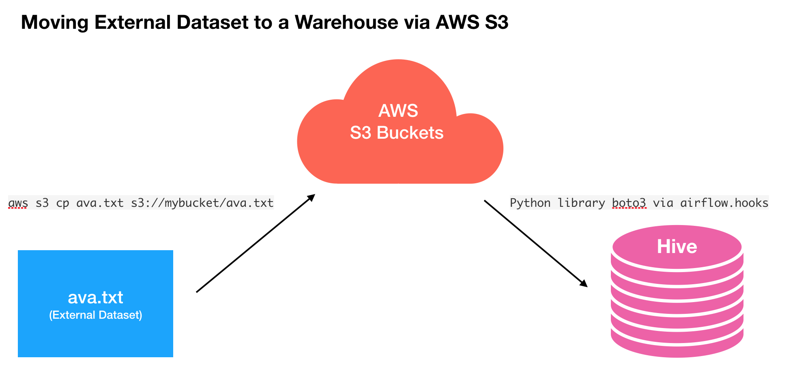

## NIMA: Neural Image Assessment

In “NIMA: Neural Image Assessment”, Google introduce a deep CNN that is trained to predict which images a typical user would rate as looking good (technically) or attractive (aesthetically). NIMA relies on the success of state-of-the-art deep object recognition networks, building on their ability to understand general categories of objects despite many variations. Our proposed network can be used to not only score images reliably and with high correlation to human perception, but also it is useful for a variety of labor intensive and subjective tasks such as intelligent photo editing, optimizing visual quality for increased user engagement, or minimizing perceived visual errors in an imaging pipeline. 

* The full announcement on Google AI blog is [here](https://ai.googleblog.com/2017/12/introducing-nima-neural-image-assessment.html).
* [NIMA Paper](https://arxiv.org/pdf/1709.05424.pdf)
* [AVA Dataset](http://refbase.cvc.uab.es/files/MMP2012a.pdf)
* [Implementation on Github](https://github.com/titu1994/neural-image-assessment)
* [AVA dataset on Github](https://github.com/mtobeiyf/ava_downloader)

The innovation of the NIMA paper is not necessarily in the neural architecture (It's actually just pre-trained CNN model + 1 FC + softmax with 10x1 output), but in the dataset that is being used + custom loss function called `earth_mover_loss`. Essentially, the AVA dataset consists of 250K photos, each is rated about 200 times, so we get a rating histogram as the label (not just a mean score). The NIMA model attempts to predict the rating histogram, which allows the end-user to calculate quality score using the mean as well as a score for how unconventional the picture is (using the `sd` of the rating histogram).

## Deliberate Practice

One of the immediate things that I can practice is to learn how to retrain the NIMA model using the AVA dataset, which involves two major tasks:

* Make AVA dataset available in the data warehouse

* Set up a NIMA retraining pipeline

Let's see how we can achieve each of the major tasks

### Make AVA dataset available in the data warehouse



In order to retrain the NIMA model, we need to make the training data, AVA dataset, available in our data warehouse. We would do this by

* Download a physical copy of the AVA dataset.
* Upload the AVA dataset onto s3 buckets s3://mybucket
* Download each image from S3 to perform post-processing: resizing -> reorienting -> base64 encoding

#### Learning Objectives

* How to create a S3 bucket and dump arbitrary files onto S3. See [documentation](https://docs.aws.amazon.com/cli/latest/reference/s3/cp.html#examples).

```bash
aws s3 cp test.txt s3://mybucket/test2.txt
```

* How to use Python library boto3 to download files from S3. See [documentation](https://boto3.readthedocs.io/en/latest/guide/s3-example-download-file.html).

```python
import boto3
import botocore

BUCKET_NAME = 'my-bucket' # replace with your bucket name
KEY = 'my_image_in_s3.jpg' # replace with your object key

s3 = boto3.resource('s3')

try:
    s3.Bucket(BUCKET_NAME).download_file(KEY, 'my_local_image.jpg')
except botocore.exceptions.ClientError as e:
    if e.response['Error']['Code'] == "404":
        print("The object does not exist.")
    else:
        raise
```

* How to use tr in UNIX to replace delimiters in a raw .txt file. See [stackoverflow answer](https://unix.stackexchange.com/questions/145978/replace-multiple-spaces-with-one-using-tr-only).

```bash
$ tr -s " ", "," < input.txt > output.txt
```

* How to encode/decode image data using base64 library

```python
try:
        FILE_PATH = os.path.join(IMAGE_DIR, file_name)
        img_rgb = Image.open(FILE_PATH).convert('RGB')
        img_rgb = im.reorient(img_rgb)
        img_rgb = im.resize(img_rgb)
    except:
        "Unable to process file {}".format(file_name)
    
    with contextlib.closing(StringIO()) as output:
        img_rgb.save(output, format='jpeg')
        image_str = base64.b64encode(output.getvalue())
```

* Upload a Pandas dataframe to Hive using airflow [hive.hooks](https://github.com/apache/incubator-airflow/blob/master/airflow/hooks/hive_hooks.py#L303-L377)

```python
cli.load_df(
    Xt
    , table='my_table_name'
    , create=True
    , recreate=True
    , field_dict=OrderedDict([
    ...
    , partition={'ds': '2018-08-19'}
    , encoding='utf8'
    , pandas_kwargs={'header': False, 'index': False}
)
```

See `photo_scoring_nima_upload_ava_dataset.ipynb` to see the actual code.


### Setting up Retraining Pipeline

See `photo_scoring_nima_retraining_pipeline.ipynb` for more details.