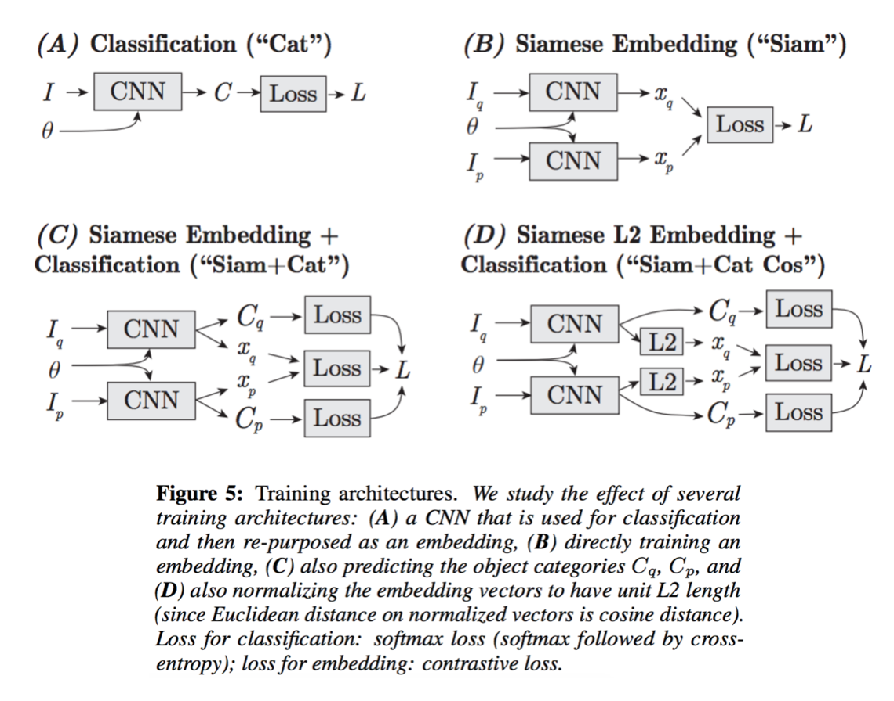
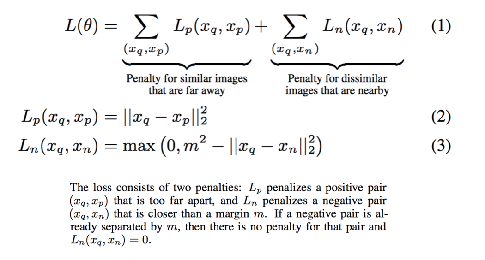

## Visual Similarity Search Using Siamese Network


In `Learning visual similarity for product design with convolutional neural networks`, Sean Bell and Kavita Bala (Chair of Computer Science at Cornell). In this paper, Bell and Bala explains how to leverage `Siamese Network` to train a model to do visual similarity search. There are a few good concepts in here.


### Siamese Network

Different kind of Siamese Network is presented in the paper:



Additional Reading [here](http://slazebni.cs.illinois.edu/spring17/lec09_similarity.pdf).


### Contrastive Loss Function 



### Generating Positive & Negative Pairs

From the paper, they explain how they generates positive v.s. negative examples:

> The contrastive loss function consists of two types of examples: positive examples of similar pairs and negative examples of dissimilar pairs. Figure 9 shows how the contrastive loss works for positive and negative examples respectively for our domain. The gradient of the loss function acts like a force (shown as a red arrow) that pulls
together `xq` and `xp` and pushes apart `xq` and `xn`.

> We have 101,945 pairs of the form: (in-situ bounding box, iconic product image). This forms all of our positive examples (Iq, Ip). To build negative examples, we take each in-situ image Iq and pick 80 random product images of the same object category, and 20 random product images of a different category. We repeat the positive pair
5 times, to give a 1:20 positive to negative ratio.

### Quality Control For Labeling

**Sentinels**: Sentinels are secret test items randomly mixed into each task. In the paper, since they are trying to label bounding boxes, their policy is that users must agree with the ground truth by having an intersection-over-union (IOU) score of at least 0.7. If users make at least `n` mistakes and have an accuracy less
than `n·10%, 3 ≤ n ≤ 8`, they prevent the user from submitting.

**Duplication**: Even if a worker is reliable, they may be given a difficult example, or they may make occasional small mistakes. Therefore, we collect two copies of every bounding box and check whether the workers agree. If the intersection-over-union (IOU) of the two boxes is above 0.7, then we choose the box from the worker with the higher average sentinel score. If the workers disagree, we collect more boxes (up to 5) until we find a pair of responses that agrees (IOU ≥ 0.7). This is meant to get higher quality data for difficult tasks.


### Example Code

Training MNIST dataset using Siamese Network using Keras, see [code](https://github.com/keras-team/keras/blob/master/examples/mnist_siamese.py) here. Some highlights:

```python
def contrastive_loss(y_true, y_pred): # <- I think this implementation is wrong ?
    '''Contrastive loss from Hadsell-et-al.'06
    http://yann.lecun.com/exdb/publis/pdf/hadsell-chopra-lecun-06.pdf
    '''
    margin = 1
    sqaure_pred = K.square(y_pred)
    margin_square = K.square(K.maximum(margin - y_pred, 0))
    return K.mean(y_true * sqaure_pred + (1 - y_true) * margin_square)
```

```python
def create_base_network(input_shape):
    '''Base network to be shared (eq. to feature extraction).
    '''
    input = Input(shape=input_shape)
    x = Flatten()(input)
    x = Dense(128, activation='relu')(x)
    x = Dropout(0.1)(x)
    x = Dense(128, activation='relu')(x)
    x = Dropout(0.1)(x)
    x = Dense(128, activation='relu')(x)
    return Model(input, x)

# network definition
base_network = create_base_network(input_shape)

input_a = Input(shape=input_shape)
input_b = Input(shape=input_shape)

# because we re-use the same instance `base_network`,
# the weights of the network
# will be shared across the two branches
processed_a = base_network(input_a)
processed_b = base_network(input_b)

# https://keras.io/layers/core/#lambda
distance = Lambda(euclidean_distance,
                  output_shape=eucl_dist_output_shape)([processed_a, processed_b])

model = Model([input_a, input_b], distance)
```