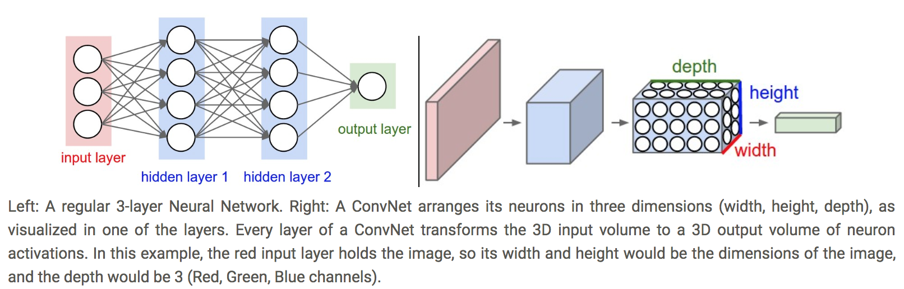
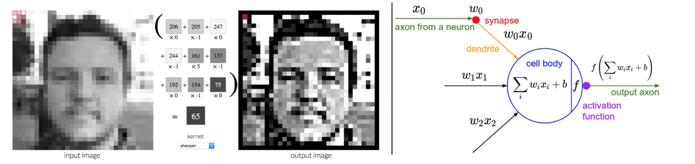
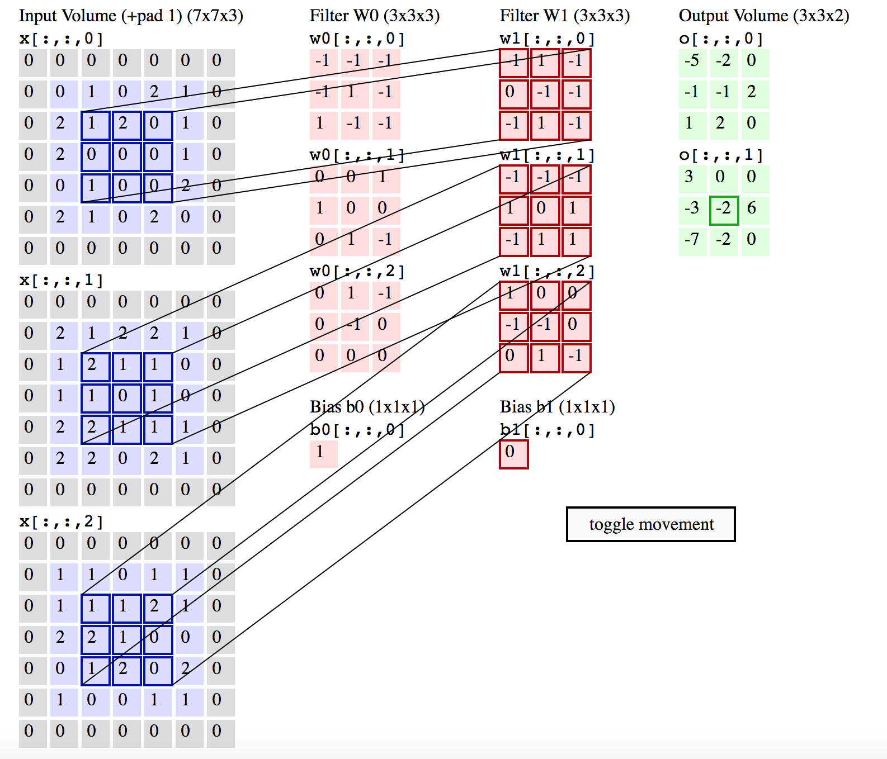
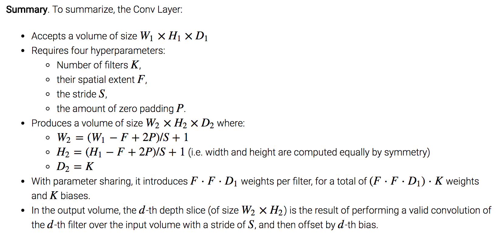
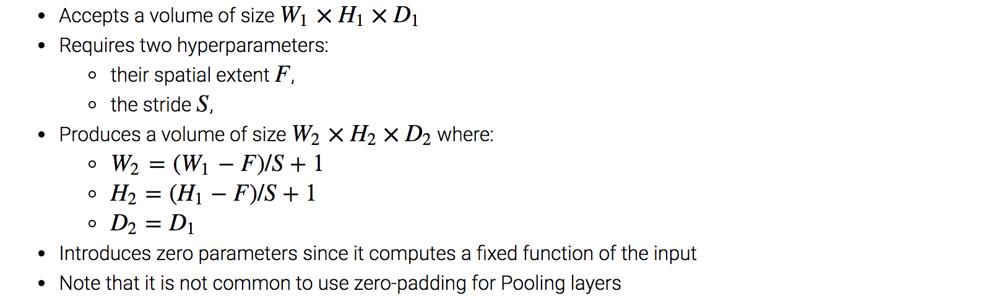
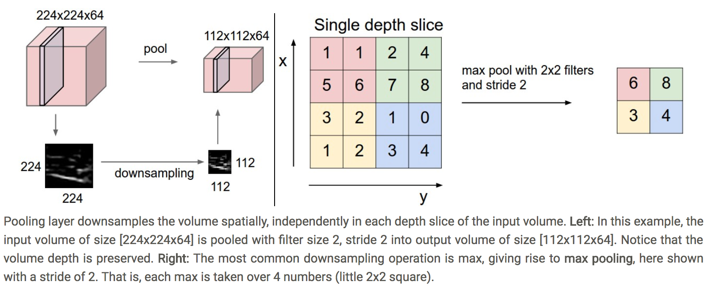

# Convolution Neural Network

_The notes below are largely adapted from Stanford's CS 231N notes._ 

## Table of Contents (AKA Major Concept Map)

* [Motivation for CNN](https://github.com/robert8138/deep-learning-deliberate-practice/blob/master/concepts/convolutional_neural_network.md#motivation-for-cnn)
* [High Level Mental Model of CNN](https://github.com/robert8138/deep-learning-deliberate-practice/blob/master/concepts/convolutional_neural_network.md#high-level-mental-model-of-cnn)
* [Different Layer Building Blocks In CNN](https://github.com/robert8138/deep-learning-deliberate-practice/blob/master/concepts/convolutional_neural_network.md#different-layer-building-blocks-in-cnn)
	* [Convolutional Layer](https://github.com/robert8138/deep-learning-deliberate-practice/blob/master/concepts/convolutional_neural_network.md#convolutional-layer)
		* [Parameters](https://github.com/robert8138/deep-learning-deliberate-practice/blob/master/concepts/convolutional_neural_network.md#parameters-weights--bias)
		* [Convolution in actions](https://github.com/robert8138/deep-learning-deliberate-practice/blob/master/concepts/convolutional_neural_network.md#convolution-in-actions)
		* [Visualize convolution in actions](https://github.com/robert8138/deep-learning-deliberate-practice/blob/master/concepts/convolutional_neural_network.md#visualize-convolution-in-actions)
		* [Hyperparameter in CONV layers](https://github.com/robert8138/deep-learning-deliberate-practice/blob/master/concepts/convolutional_neural_network.md#hyperparameters-of-conv-layer)
		* [Know your dimensions](https://github.com/robert8138/deep-learning-deliberate-practice/blob/master/concepts/convolutional_neural_network.md#know-your-input-dimensions---conv-layer---output-dimensions)
		* [Matrix Implementation [WIP]](https://github.com/robert8138/deep-learning-deliberate-practice/blob/master/concepts/convolutional_neural_network.md#matrix-implementation)
		* [Backpropagation [WIP]](https://github.com/robert8138/deep-learning-deliberate-practice/blob/master/concepts/convolutional_neural_network.md#backpropagation)
	* [Pooling Layer](https://github.com/robert8138/deep-learning-deliberate-practice/blob/master/concepts/convolutional_neural_network.md#pooling-layer)
	* [Fully-connected Layer](https://github.com/robert8138/deep-learning-deliberate-practice/blob/master/concepts/convolutional_neural_network.md#fully-connected-layer)
* [Other Resources](https://github.com/robert8138/deep-learning-deliberate-practice/blob/master/concepts/convolutional_neural_network.md#other-resources)

## Motivation for CNN

Recall: Regular Neural Nets receive an input (a single vector), and transform it through a series of hidden layers. Each hidden layer is made up of a set of neurons, where each neuron is fully connected to all neurons in the previous layer, and where neurons in a single layer function completely independently and do not share any connections.

Regular Neural Nets don’t scale well to full images. In CIFAR-10, images are only of size 32x32x3 (32 wide, 32 high, 3 color channels), so a single fully-connected neuron in a first hidden layer of a regular Neural Network would have 32*32*3 = 3072 weights. This amount still seems manageable, but clearly this fully-connected structure does not scale to larger images. For example, an image of more respectable size, e.g. 200x200x3, would lead to neurons that have 200*200*3 = 120,000 weights. Moreover, we would almost certainly want to have several such neurons, so the parameters would add up quickly! Clearly, this full connectivity is wasteful and the huge number of parameters would quickly lead to overfitting.

CNN solves this problem by leveraging **parameter sharing**, see the parameter sharing section in the CS231N notes for more details.

## High Level Mental Model of CNN

Unlike a regular Neural Network, the layers of a ConvNet have neurons arranged in 3 dimensions: **width**, **height**, **depth**. (Note that the word depth here refers to the third dimension of an activation volume, not to the depth of a full Neural Network, which can refer to the total number of layers in a network. 

As we will soon see, the neurons in a layer will only be connected to a small region of the layer before it, instead of all of the neurons in a fully-connected manner.

In short, **a ConvNet is made up of Layers. Every Layer has a simple API: It transforms an input 3D volume to an output 3D volume** with some differentiable function that may or may not have parameters. The picture below highlights the (different) mental of regular neural network and CNN:

## Different Layer Building Blocks In CNN

As we described above, a simple ConvNet is a sequence of layers, and every layer of a ConvNet transforms one volume of activations to another through a differentiable function. We use three main types of layers to build ConvNet architectures: **Convolutional Layer**, **Pooling Layer**, and **Fully-Connected Layer** (exactly as seen in regular Neural Networks). We will stack these layers to form a full ConvNet architecture. Note, each layer may or may not have parameters (e.g. CONV/FC have parameters weights `W` and bias `b`, RELU/POOL don't). Furthermore, each layer may or may not have additional hyperparameters (e.g. CONV/FC/POOL do, RELU doesn't).

### Convolutional Layer

#### Parameters (weights & bias)

The Conv layer is the core building block of a Convolutional Network that does most of the computational heavy lifting. The most important understanding about CONV layer is their parameters - The CONV layer’s parameters consist of a set of learnable **filters**. Every filter is small spatially (along width and height), but extends through the full depth of the input volume. 

#### Convolution in actions

Mechanically, during the forward pass, we slide (more precisely, convolve) each filter volume across the width and height of the input volume and compute dot products between the entries of the filter (a volume) and the input (another small volume) at any position. It is important to emphasize again this asymmetry in how we treat the spatial dimensions (width and height) and the depth dimension: The connections are local in space (along width and height), but always full along the entire depth of the input volume. The examples in Andrey's note demonstrate this key requirement for the filters.

As we slide the filter over the width and height of the input volume we will produce a 2-dimensional activation map that gives the responses of that filter at every spatial position. Intuitively, the network will learn filters that activate when they see/scan through some type of visual feature. 

#### Visualize convolution in actions

When I first was learning the convolution operations in the CONV layer, the picture that clicked was the one below: essentially, mathematically, we are still taking the dot product of `w` with `x` + bias `b` term, but VISUALLY, we are basically doing **element-wise dot product** of the [**image kernel**](http://setosa.io/ev/image-kernels/) with the local region of the volume (volume here could be the image itself or the intermediate volume in CNN). 

The picture below only shows dot product of image kernel with 2D volume, in reality, the filters are 3Ds and the local input volume would also be 3Ds, and the sum of elementwise product just reduce everything to 1 number <- this sliding over width and height gives us a thin, 1 single slice of the activation map.

For each layer, we might have multiple filters, and as we perform the same operations, more and more single slice of the activation map will get produced, and when we stack them together, we get the 3D output volume again.

CS 231N has yet another really nice d3 demo on convolution in actions:

Another another animation to reinforce the idea of how convolution works can be found in [Convolution Visualized](https://github.com/vdumoulin/conv_arithmetic), a github repo that beautifully visualized convolution operations and transpose convolution operations in CNN.

#### Hyperparameters of CONV layer

Three hyperparameters control the size of the output volume: the depth, stride and zero-padding.

* First, the **depth** of the output volume is a hyperparameter: it corresponds to the number of filters we would like to use, each learning to look for something different in the input. For example, if the first Convolutional Layer takes as input the raw image, then different neurons along the depth dimension may activate in presence of various oriented edges, or blobs of color. We will refer to a set of neurons that are all looking at the same region of the input as a **depth column**

* Second, we must specify the **stride** with which we slide the filter. When the stride is 1 then we move the filters one pixel at a time. When the stride is 2 (or uncommonly 3 or more, though this is rare in practice) then the filters jump 2 pixels at a time as we slide them around. This will produce smaller output volumes spatially. Think of this as how fast we are sweeping through the image.

* As we will soon see, sometimes it will be convenient to pad the input volume with zeros around the border. The size of this **zero-padding** is a hyperparameter. The nice feature of zero padding is that it will allow us to control the spatial size of the output volumes (most commonly as we’ll see soon we will use it to exactly preserve the spatial size of the input volume so the input and output width and height are the same).

Spatial Size (Width & Height, not including depth) of the Output Volume: We can compute the spatial size of the output volume as a function of the input volume size (`W`), the receptive field size of the Conv Layer neurons (`F`), the stride with which they are applied (`S`), and the amount of zero padding used (`P`) on the border. You can convince yourself that the correct formula for calculating how many neurons “fit” is given by `(W−F+2P)/S+1`.

#### Know your Input Dimensions -> CONV layer -> Output dimensions

#### Matrix Implementation 

CS 231N notes explained this a little bit, but I never worked out the math myself.

#### Backpropagation

I don't think I understand how backprop really works in CNN yet.

### Pooling Layer

It is common to periodically insert a Pooling layer in-between successive Conv layers in a ConvNet architecture. Its function is to progressively reduce the spatial size of the representation to reduce the amount of parameters and computation in the network, and hence to also control overfitting.

The Pooling Layer operates independently on every depth slice of the input and resizes it spatially, using the MAX operation. The most common form is a pooling layer with filters of size 2x2 applied with a stride of 2 downsamples every depth slice in the input by 2 along both width and height, discarding 75% of the activations. Every MAX operation would in this case be taking a max over 4 numbers (little 2x2 region in some depth slice).

Here is a visualization of how pooling works in action:

Similarly, I think I am still fuzzy on how backprop works on Pooling layers

### Fully-connected layer

Neurons in a fully connected layer have full connections to all activations in the previous layer, as seen in regular Neural Networks. Their activations can hence be computed with a matrix multiplication followed by a bias offset. They are typically used at the end of the CNN operations to compute OUTPUT of the model.

## Other Resources

* [CNN Gently Explained on Medium](https://medium.com/@ageitgey/machine-learning-is-fun-part-3-deep-learning-and-convolutional-neural-networks-f40359318721): A lot of visual explanations, focus on intuition.

* [Visualize CNN - from Colab](http://colah.github.io/posts/2014-07-Conv-Nets-Modular/): convolutional neural networks can be thought of as a kind of neural network that uses many identical copies of the same neuron.1 This allows the network to have lots of neurons and express computationally large models while keeping the number of actual parameters – the values describing how neurons behave – that need to be learned fairly small.

* [Understand Convolution - from colab](http://colah.github.io/posts/2014-07-Understanding-Convolutions/): Understand the mathematical nature of convolution

## ConvNet Architectures

* [CS231N CNN Intro](http://cs231n.github.io/convolutional-networks/): This post is, by far, the most comprehensive post that explains the architecture of CNN, the parameters involved, the input volume, the output volume, and more. It's a very meaty read, but gives a very detailed treatment of CNN. It focuses a lot on the architecture and different kind of layers in CNN, it doesn't talk much about how backpropogation works in the context of CNN. Some highlights:

	* A ConvNet architecture is in the simplest case a list of Layers that transform the image volume into an output volume (e.g. holding the class scores). 
		* There are a few distinct types of Layers (e.g. CONV/FC/RELU/POOL are by far the most popular). 
		Each Layer accepts an input 3D volume and transforms it to an output 3D volume through a differentiable function. 
		* Each Layer may or may not have parameters (e.g. CONV/FC do, RELU/POOL don’t)
		* Each Layer may or may not have additional hyperparameters (e.g. CONV/FC/POOL do, RELU doesn’t)

	* **Convolutional Layer (CONV)**: You need to have a good understanding of how input volume are transformed to output volume. 
		* The "neuron picture" that takes element-wise dot product of "input patch" on "fitler" + bias is very helpful
		* Know all the hyperparameters: depth, padding, stride, filter size. Know how to use these to calculate input & output volume dimensions
		* The numpy example + visualization demo is a good way to understnad how the math works

	* **Pooling Layer (P)**: 
		* Know the hyperparameters in pooling layer, and how to calculate dimensions

	* **Fully Connected Layers (FC)**
		* One can convert between CONV layer and FC layers

	* **ConvNet Architectures** is a great section: `INPUT -> [[CONV -> RELU]*N -> POOL?]*M -> [FC -> RELU]*K -> FC`

	* It also surveys different kind of CNN, quite useful overview of state of the art CNNs.