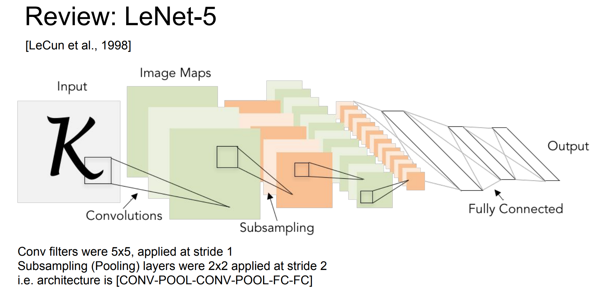
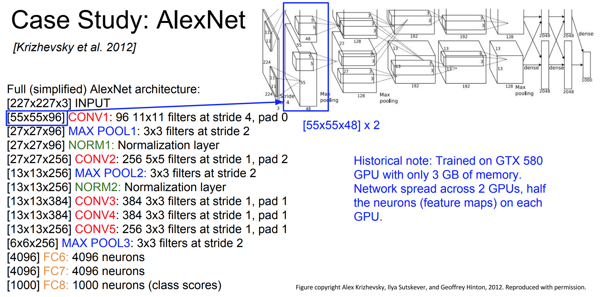
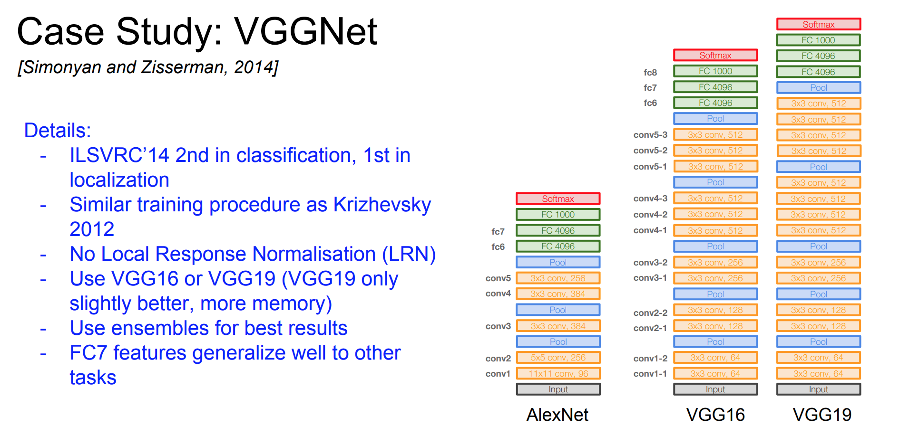
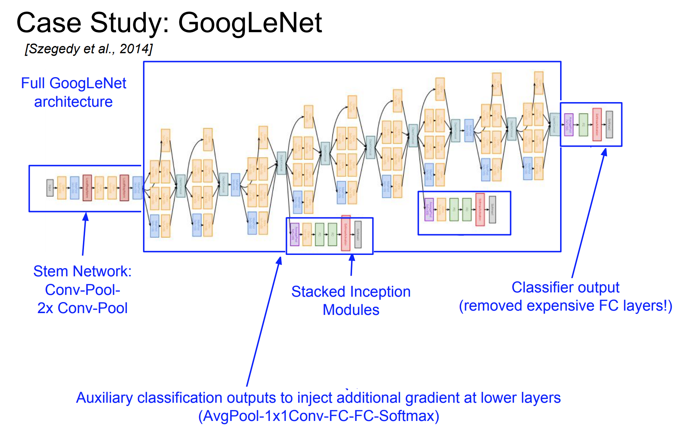
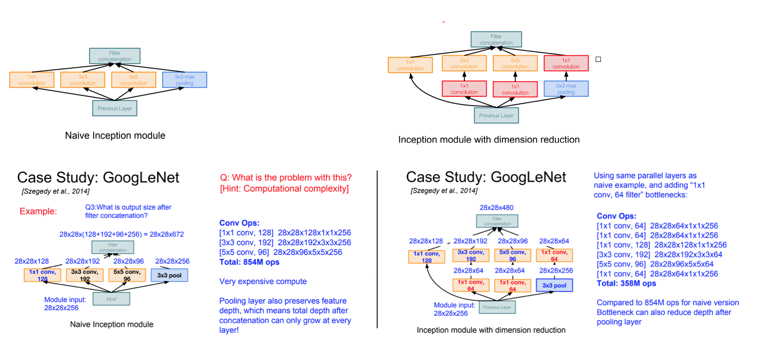
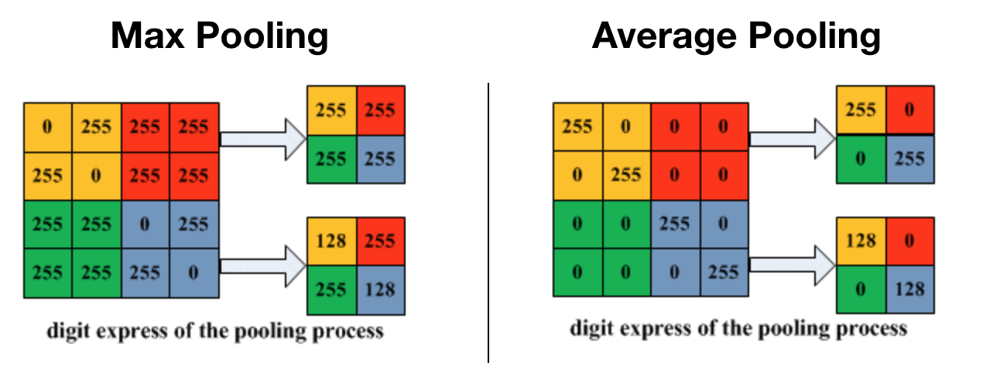
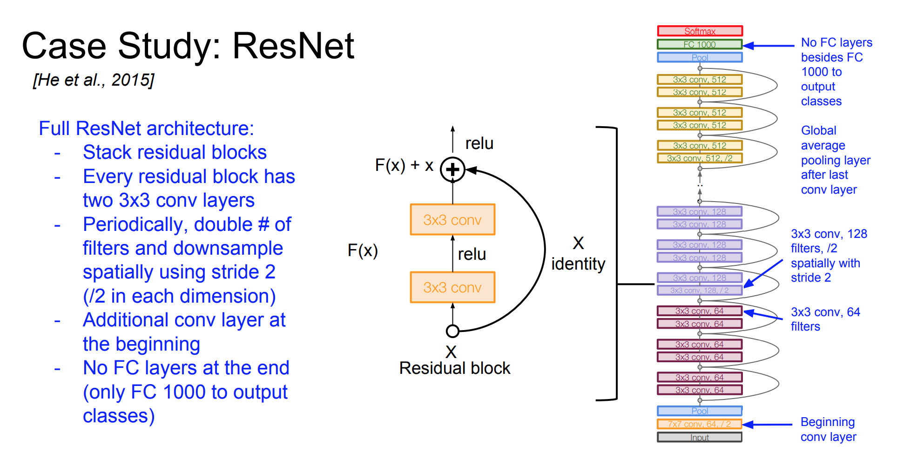
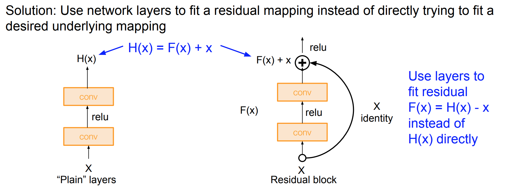
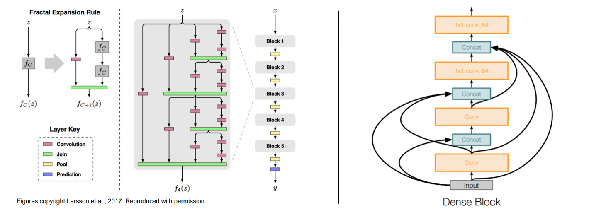
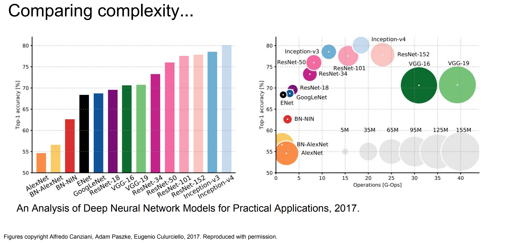

# ConvNet Architectures

## Table of Contents

* [ConvNet Layer Pattern](https://github.com/robert8138/deep-learning-deliberate-practice/blob/master/concepts/convolutional_neural_network_architecture.md#convnet-layer-patterns)
* [Layer Sizing Pattern](https://github.com/robert8138/deep-learning-deliberate-practice/blob/master/concepts/convolutional_neural_network_architecture.md#layer-sizing-patterns)
* [CNN Architectures](https://github.com/robert8138/deep-learning-deliberate-practice/blob/master/concepts/convolutional_neural_network_architecture.md#cnn-architectures)
	* [LeNet](https://github.com/robert8138/deep-learning-deliberate-practice/blob/master/concepts/convolutional_neural_network_architecture.md#lenet)
	* [AlexNet](https://github.com/robert8138/deep-learning-deliberate-practice/blob/master/concepts/convolutional_neural_network_architecture.md#2012-alexnet)
	* [VGGNet](https://github.com/robert8138/deep-learning-deliberate-practice/blob/master/concepts/convolutional_neural_network_architecture.md#2014-vggnet)
	* [GoogLeNet](https://github.com/robert8138/deep-learning-deliberate-practice/blob/master/concepts/convolutional_neural_network_architecture.md#2014-googlenet--inception-model--network-within-a-network)
		* [Inception Module](https://github.com/robert8138/deep-learning-deliberate-practice/blob/master/concepts/convolutional_neural_network_architecture.md#inception-module)
		* [Average Pooling](https://github.com/robert8138/deep-learning-deliberate-practice/blob/master/concepts/convolutional_neural_network_architecture.md#average-pooling)
	* [ResNet](https://github.com/robert8138/deep-learning-deliberate-practice/blob/master/concepts/convolutional_neural_network_architecture.md#2015-residual-network)
		* [Residual Block](https://github.com/robert8138/deep-learning-deliberate-practice/blob/master/concepts/convolutional_neural_network_architecture.md#residual-block-revolution-in-depth)
		* [Gradient Highway](https://github.com/robert8138/deep-learning-deliberate-practice/blob/master/concepts/convolutional_neural_network_architecture.md#gradient-highway)
* [Model Complexity](https://github.com/robert8138/deep-learning-deliberate-practice/blob/master/concepts/convolutional_neural_network_architecture.md#model-complexity-comparison)
* [Advice for Architecture](https://github.com/robert8138/deep-learning-deliberate-practice/blob/master/concepts/convolutional_neural_network_architecture.md#advice-for-architecture)

_The notes below are adapted from Stanford's CS 231N notes and CS 231N lecture notes, all rights belong to the course creataor._ 

## ConvNet Layer Patterns

We have seen that Convolutional Networks are commonly made up of only three layer types: CONV, POOL (we assume Max pool unless stated otherwise) and FC (short for fully-connected). We will also explicitly write the RELU activation function as a layer, which applies elementwise non-linearity. In this section we discuss how these are commonly stacked together to form entire ConvNets.

The most common form of a ConvNet architecture stacks a few CONV-RELU layers, follows them with POOL layers, and repeats this pattern until the image has been merged spatially to a small size. At some point, it is common to transition to fully-connected layers. The last fully-connected layer holds the output, such as the class scores. In other words, the most common ConvNet architecture follows the pattern:

```
INPUT -> [[CONV -> RELU]*N -> POOL?]*M -> [FC -> RELU]*K -> FC = OUTPUT
```

where the `*` indicates repetition, and the `POOL?` indicates an optional pooling layer. Moreover, `N >= 0` (and usually `N <= 3`), `M >= 0`, `K >= 0` (and usually `K < 3`).

## Layer Sizing Patterns

The **input layer** (that contains the image) should be divisible by 2 many times. Common numbers include 32 (e.g. CIFAR-10), 64, 96 (e.g. STL-10), or 224 (e.g. common ImageNet ConvNets), 384, and 512.

The **conv layers** should be using small filters (e.g. 3x3 or at most 5x5), using a stride of S=1, and crucially, padding the input volume with zeros in such way that the conv layer does not alter the spatial dimensions of the input. That is, when F=3, then using P=1 will retain the original size of the input. When `F=5`, `P=2`. For a general `F`, it can be seen that `P=(F−1)/2` preserves the input size. If you must use bigger filter sizes (such as `7x7` or so), it is only common to see this on the very first conv layer that is looking at the input image.

The **pool layers** are in charge of downsampling the spatial dimensions of the input. The most common setting is to use max-pooling with `2x2` receptive fields (i.e. `F=2`), and with a stride of `2` (i.e. `S=2`). Note that this discards exactly 75% of the activations in an input volume (due to downsampling by 2 in both width and height). It is very uncommon to see receptive field sizes for max pooling that are larger than 3 because the pooling is then too lossy and aggressive. This usually leads to worse performance.

Reducing sizing headaches. The scheme presented above is pleasing because all the CONV layers preserve the spatial size of their input, while the POOL layers alone are in charge of down-sampling the volumes spatially. In an alternative scheme where we use strides greater than 1 or don’t zero-pad the input in CONV layers, we would have to very carefully keep track of the input volumes throughout the CNN architecture and make sure that all strides and filters “work out”, and that the ConvNet architecture is nicely and symmetrically wired.

## CNN Architectures

### [1998] LeNet

The first successful applications of Convolutional Networks were developed by Yann LeCun in 1990’s. Of these, the best known is the LeNet architecture that was used to read zip codes, digits for USPS. The architecture is `INPUT -> CONV -> POOL -> CONV -> POOL -> FC -> FC -> OUTPUT`



### [2012] AlexNet

AlexNet is the first CNN-based winner for the ImageNet Large Scale Visual Recognition Challenge (ILSVRC) using ImageNet data. The first work that popularized Convolutional Networks in Computer Vision was the AlexNet, developed by Alex Krizhevsky, Ilya Sutskever and Geoff Hinton. The AlexNet was submitted to the ImageNet ILSVRC challenge in 2012 and significantly outperformed the second runner-up (top 5 error of 16% compared to runner-up with 26% error). The Network had a very similar architecture to LeNet, but was deeper, bigger, and featured Convolutional Layers stacked on top of each other (previously it was common to only have a single CONV layer always immediately followed by a POOL layer).

A few interesting historical details: It's the first model that uses RELU, it uses normalization layer (not common now), and because GPU was still not powerful enough, the network is spread across 2 GPUs, meaning half the neurons (feature maps) are on each GPU, see picture below.



The 2013 winner was ZFNet, which is very similar to AlexNet, but with hyperparameter tuning (detail omitted here).

### [2014] VGGNet

The runner-up in ILSVRC 2014 was the network from Karen Simonyan and Andrew Zisserman that became known as the VGGNet. Its main contribution was in **showing that the depth of the network is a critical component for good performance**. Their final best network contains 16 CONV/FC layers and, appealingly, features an extremely homogeneous architecture that only performs 3x3 convolutions and 2x2 pooling from the beginning to the end. 

A downside of the VGGNet is that it is more expensive to evaluate and uses a lot more memory and parameters (140M), where most of these parameters are in the first fully connected (FC) layer. The characteristics of VGG model is that at the memory size is much larger earlier in the network (image data with `W x H x C`), and parameter size is much larger in the later of the network (the first FC layer). It was since found that these FC layers can be removed with no performance downgrade, significantly reducing the number of necessary parameters.




### [2014] GoogLeNet / Inception Model / Network within a Network

The ILSVRC 2014 winner was a Convolutional Network from Szegedy et al. from Google. Its main contribution was the development of an **Inception Module** that dramatically reduced the number of parameters in the network (4M, compared to AlexNet with 60M). Additionally, this paper uses **Average Pooling** instead of Fully Connected layers at the top of the ConvNet, eliminating a large amount of parameters that do not seem to matter much. There are also several followup versions to the GoogLeNet, most recently [Inception-v4](https://arxiv.org/abs/1602.07261).



#### Inception Module

**Inception module** design a good local network topology (network within a network) and then stack these modules on top of each other.



#### Average Pooling

Average pooling simply takes the average by pooling the adjacent pixels. In GoogLeNet, this replaces expensive FC layers.



### [2015] Residual Network

Residual Network developed by Kaiming He et al. was the winner of ILSVRC 2015. It features special **skip connections** and a heavy use of **batch normalization**. The architecture is also missing fully connected layers at the end of the network. ResNets are currently by far state of the art Convolutional Neural Network models and are the default choice for using ConvNets in practice (as of May 10, 2016).



#### Residual Block (Revolution in Depth)

One of the innovation of ResNet model is the invention of residual block. Residual blocks are created to address the **optimization** problem that very deep models are hard to train because the graident (after many matrix multiplication) can just vanish. In theory, the deeper model should be able to perform at least as well as the shallower model. So a solution that was proposed was to copy the learned layers from the shallower model and setting additional layers to identity mapping.

It's worth mentioning for deeper ResNet (i.e. ResNet50+ models), the "bottleneck" layer trick is again applied.



#### Gradient Highway

The original author of ResNet has also argued that its the residual that matters, not depth, so he tried wider residual blocks, and showed 50-layer wide ResNet outperforms 152-layer original ResNet. Increasing width instead of depth also is more computationally efficient (parallelizable).

Furthermore, a lot of work has been done to ensure that more connections are added ("gradient highway") are added throughout the network to ensure gradient flow can be easy.



#### Batch Normalization

Skipped. See Batch Normalization Section

## Model Complexity Comparison

* `AlexNet`, the original pioneer, memory heavy, slow to compute, and lower accuracy
* `VGG` has the highest memory, and most operations
* `GoogLetNet` is the most efficient, with good performance
* `Resnet` moderate efficiency depending on model, highest accuracy
* `Inception v4: Inception + ResNet` is the state of the art - highest accuracy



## Advice for Architecture

In practice: use whatever works best on ImageNet. If you’re feeling a bit of a fatigue in thinking about the architectural decisions, you’ll be pleased to know that in 90% or more of applications you should not have to worry about these. I like to summarize this point as “don’t be a hero”: Instead of rolling your own architecture for a problem, you should look at whatever architecture currently works best on ImageNet, download a pretrained model and finetune it on your data. You should rarely ever have to train a ConvNet from scratch or design one from scratch. I also made this point at the Deep Learning school.