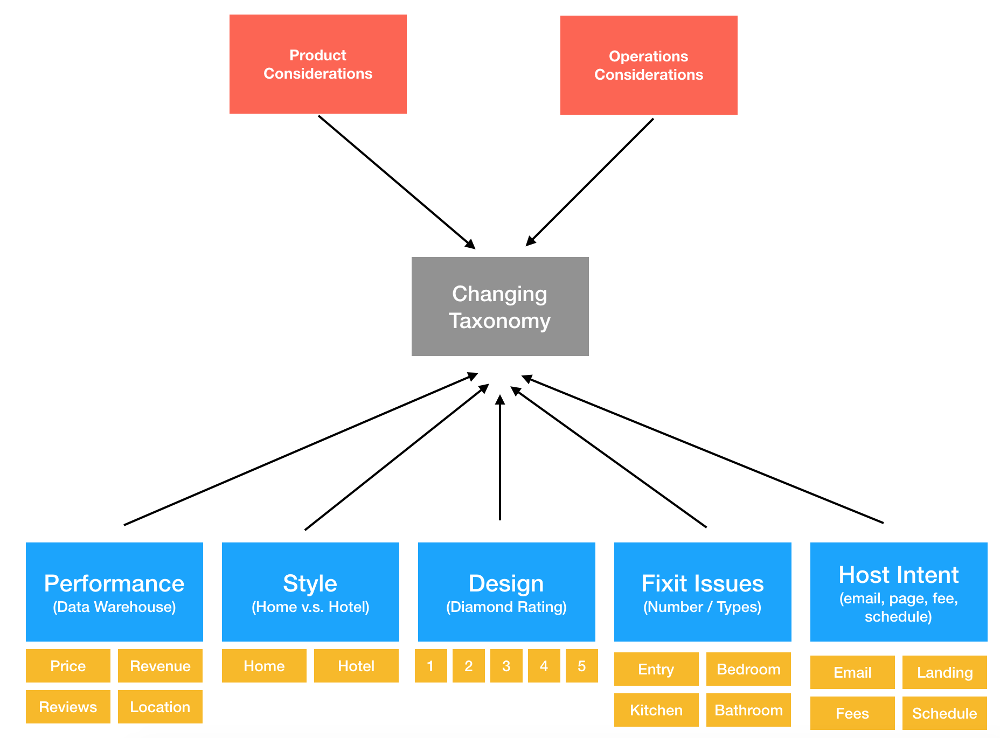
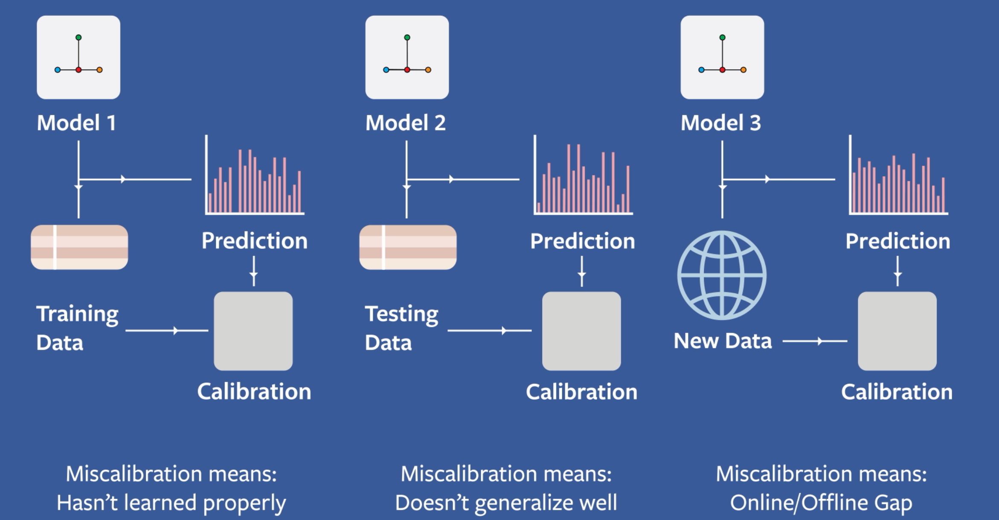
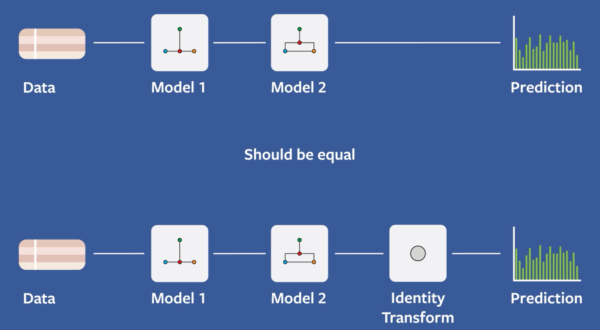
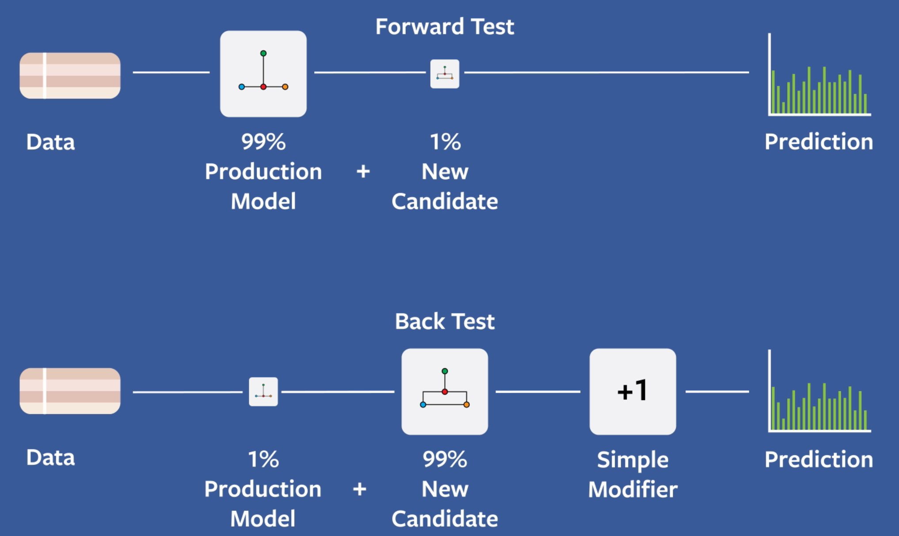

# Deep Learning Workflow

_In this document, I will combine Chapter 4 of Francois Chollet's Book "Deep Learning with Python" + resources from Facebook's Machine Learning Field Guide. Chollet's book focuses more on Deep Learning, while FB's ML field guide focuses more on considerations one needs to think about in building ML in production._

# Table of Contents

* [Defining the Problem](https://github.com/robert8138/deep-learning-deliberate-practice/blob/master/concepts/work_in_progress/deep_learning_workflow.md#defining-the-problem)
	* [Determine the Right Business Goals for Your ML Project](https://github.com/robert8138/deep-learning-deliberate-practice/blob/master/concepts/work_in_progress/deep_learning_workflow.md#determine-the-right-business-goals-for-your-ml-project)
	* [Properties of Good Proxy Events](https://github.com/robert8138/deep-learning-deliberate-practice/blob/master/concepts/work_in_progress/deep_learning_workflow.md#properties-of-good-proxy-event)
	* [Determine the Right Learning Task for Your ML Project](https://github.com/robert8138/deep-learning-deliberate-practice/blob/master/concepts/work_in_progress/deep_learning_workflow.md#determine-the-right-learning-task-for-your-ml-project)
	* [Be Aware of Your Assumptions](https://github.com/robert8138/deep-learning-deliberate-practice/blob/master/concepts/work_in_progress/deep_learning_workflow.md#be-aware-of-your-assumptions)
	* [Case Study: Plus Lead Scoring Model]()

* [Defining the Loss Function of Your Learning Task](https://github.com/robert8138/deep-learning-deliberate-practice/blob/master/concepts/work_in_progress/deep_learning_workflow.md#defining-the-loss-function-of-your-learning-task)
	* [Common Loss Functions](https://github.com/robert8138/deep-learning-deliberate-practice/blob/master/concepts/work_in_progress/deep_learning_workflow.md#common-loss-function)
	* [Case Study 1: Google's Word2Vec](https://github.com/robert8138/deep-learning-deliberate-practice/blob/master/concepts/work_in_progress/deep_learning_workflow.md#case-study-1-googles-word2vec)
	* [Case Study 2: Airbnb's Smart Pricing](https://github.com/robert8138/deep-learning-deliberate-practice/blob/master/concepts/work_in_progress/deep_learning_workflow.md#case-study-2-airbnbs-smart-pricing)

* [Deciding On An Evaluation Protocol](https://github.com/robert8138/deep-learning-deliberate-practice/blob/master/concepts/work_in_progress/deep_learning_workflow.md#deciding-on-an-evaluation-protocol)
	* [Split Your Dataset For Evaluation](https://github.com/robert8138/deep-learning-deliberate-practice/blob/master/concepts/work_in_progress/deep_learning_workflow.md#split-your-dataset-for-evaluation)
	* [Be Careful How You Randomize Your Data](https://github.com/robert8138/deep-learning-deliberate-practice/blob/master/concepts/work_in_progress/deep_learning_workflow.md#be-careful-how-you-randomize-your-data)
	* [Training v.s. Evaluation set](https://github.com/robert8138/deep-learning-deliberate-practice/blob/master/concepts/work_in_progress/deep_learning_workflow.md#training-vs-evaluation-set)
	* [Evaluating on Different Cuts of Data](https://github.com/robert8138/deep-learning-deliberate-practice/blob/master/concepts/work_in_progress/deep_learning_workflow.md#evaluating-on-different-cuts-of-data)

* [Data Preprocessing & Feature Engineering](https://github.com/robert8138/deep-learning-deliberate-practice/blob/master/concepts/work_in_progress/deep_learning_workflow.md#data-preprocessing-or-feature-engineering)
	* [Data Preprocessing](https://github.com/robert8138/deep-learning-deliberate-practice/blob/master/concepts/work_in_progress/deep_learning_workflow.md#data-preprocessing)
	* [Feature Engineering](https://github.com/robert8138/deep-learning-deliberate-practice/blob/master/concepts/work_in_progress/deep_learning_workflow.md#feature-engineering)
	* [Performing JOIN](https://github.com/robert8138/deep-learning-deliberate-practice/blob/master/concepts/work_in_progress/deep_learning_workflow.md#performing-join)

* [Offline: Modeling](https://github.com/robert8138/deep-learning-deliberate-practice/blob/master/concepts/work_in_progress/deep_learning_workflow.md#offline-develop-a-model-that-overfits)
	* [Develop A Model That Does Better Than a Baseline](https://github.com/robert8138/deep-learning-deliberate-practice/blob/master/concepts/work_in_progress/deep_learning_workflow.md#develop-a-model-that-does-better-than-a-baseline)
	* [Develop a Model That Overfits](https://github.com/robert8138/deep-learning-deliberate-practice/blob/master/concepts/work_in_progress/deep_learning_workflow.md#develop-a-model-that-overfits)
	* [Regularize Your Model](https://github.com/robert8138/deep-learning-deliberate-practice/blob/master/concepts/work_in_progress/deep_learning_workflow.md#regularize-your-model)
	* [Tune Hyperparameters](https://github.com/robert8138/deep-learning-deliberate-practice/blob/master/concepts/work_in_progress/deep_learning_workflow.md#tune-hyperparameters)

* [Offline v.s. Online Evaluation](https://github.com/robert8138/deep-learning-deliberate-practice/blob/master/concepts/work_in_progress/deep_learning_workflow.md#offline-vs-online-evaluation)
	* [Minimize Time to Online Experiment](https://github.com/robert8138/deep-learning-deliberate-practice/blob/master/concepts/work_in_progress/deep_learning_workflow.md#minimize-time-to-online-experiment)
	* [Isolate Engineering Bugs From ML Performance Issues](https://github.com/robert8138/deep-learning-deliberate-practice/blob/master/concepts/work_in_progress/deep_learning_workflow.md#isolate-engineering-bugs-from-ml-performance-issues)
	* [Test Model in the Presence of Real World Feedback Loop](https://github.com/robert8138/deep-learning-deliberate-practice/blob/master/concepts/work_in_progress/deep_learning_workflow.md#test-model-in-the-presence-of-real-world-feedback-loop)

* [Final Model](https://github.com/robert8138/deep-learning-deliberate-practice/blob/master/concepts/work_in_progress/deep_learning_workflow.md#final-model)

## Defining The Problem

A good place to start for this topic is Facebook's Machine Learning Field Guide - [Video 1](https://research.fb.com/videos/field-guide-to-machine-learning-lesson-1-problem-definition/). It's important to think about what Machine Learning task for your project actually is, this can be surprisingly messy.

### Determine the Right Business Goals for Your ML Project

The first important question is: **What does success looks like?**. Often, when thinking through the problem, we might realize that the thing we actually care about (e.g. enjoyment) is more relevant, but harder to define and harder to model. Instead, a common strategy is to find **surrogate, or proxy metrics** (e.g. engagement) - they tend to be less relevant, but easier to define and easier to model. This is a typical trade-off machine learners make in defining problem statement. 

### Properties of Good Proxy Event

Here are a few properties of good proxy events:

* **Does the proxy event happened within a reasonable amount of time of the actual event?**: If not, we will not be able to get ground truth easily and validate our model performance. This would make iteration really slow.

* **Is it too sparse?**: If we don't have enough positive examples, we don't actually have many data.

* **Does features contain information to predicting the proxy event?**: These might seem obvious, but we need to be able to find good features for the learning task

* **Is the true desire outcome sensitive to variations in proxy labels?**: We want it not to be sensitive, because it's always better to start with a simple model to pair down the complexity, since engineering complexity will grow. Don't prematurely optimize.

### Determine the Right Learning Task for Your ML Project

For supervised learning: What will your input data (X) be? What are you trying to predict (y)? These decisions are often driven by the type of problem you are facing. Identifying the problem type will guide your choice of model architecture:

* **Binary Classification**: A classification task where each input sample should be categorized into two exclusive categories
* **Multiclass classification**: A classification task where each input sample should be categorized into more than two categories: for instance, classifying handwritten digits
* **Multilabel classification**: A classification task where each input sample can be assigned multiple labels. For instance, a given image may contain both a cat and a dog and should be annotated both with the “cat” label and the “dog” label. The number of labels per image is usually variable.
* **Scalar regression**: A task where the target is a continuous scalar value. Predicting house prices is a good example: the different target prices form a continuous space
* **Vector Regression**: A task where the target is a set of continuous values: for example, a continuous vector. If you’re doing regression against multiple values (such as the coordinates of a bounding box in an image), then you’re doing vector regression
* There are also unsupervised learning problems such as dimension reduction, clustering, etc that are important as well. But it's a lot more common to have supervised learning problems in industry setting.

Finally, there are also considerations for when to (or not to) use Deep Learning:

* No structure -> fully connected: 2-3 hidden layers, ReLu, BatchNorm, Adam
* Spatial structure -> convolutional: download a pretrained model, BatchNorm, Adam
* Sequential structure -> recurrent: LSTM/SGD, Gradient clipping, high forget gate bias 

For DL, need to decide what is the last layer configuration, and what optimizatino routine (Gradient Descent, Momentum, RMSprop, ADAM ... etc) to use.

### Be Aware of Your Assumptions

Be aware of the assumptions you are making at this stage:

* You hypothesize that your outputs can be predicted given your inputs
* You hypothesize that your available data is sufficiently informative to learn the relationship between inputs and outputs

### Case Study: Plus Lead Scoring Model

As an example, on Plus team, we have a lead scoring ML model that uses LTV features to predict a listing's grouping assignment (group 1 = close to Plus quality, group 5 = low quality). While the v.0 version of the model was very sucessful, the definition of grouping assignment changes over time due to business requirement. This means that whenever the grouping definition changes, we need to adapt the model to those new definitions, this can make our training data quickly obselete.

Furthermore, the fact that the model only uses features conveniently from the data warehouse but ignored all the perception based signals is suboptimal. Intuitively, the learning task is perceptual in nature and we should adapt the learning process to perception tasks.

Eventually, I decided to model the lead scoring problem at a lower level of granularity. Instead of predicting grouping directly, I try to predict signals (design rating, style assessment, number of issues) that goes into the determination of grouping. The final grouping decision will be derived using rules on these predicted signals.

## Defining the Loss Function of Your Learning Task

### Common Loss Functions

Defining the right loss function function for the learning task is perhaps the most important step in model formulation. There are obviously textbook examples of loss functions that we can use, and they are nicely summarized in [notes from CS231N](http://cs231n.github.io/neural-networks-2/#losses).

In my experience, I learned that in academic papers or really innovative projects, carefully defining the proper loss function is at the heart of defining a learning problem, and it is a craft. Anecdotally, I also feel like this is something that is more CS-like than Statistics-like, meaning that the formulation is often based on what intuition the loss function is trying to capture, rather than if there is a mathematical basis (Statistics camp).

Below, I will highlight two examples, both from industry:

### Case Study 1: Google's Word2Vec

Word2Vec, developed by Google, is one classic example where a lot of thoughts go into formulating the loss function formulation. The goal is to learn word representation by using each word's surrounding words. For the Skip-Gram (SG) model, we frame the prediction task as `P(context word | target word)`, using a softmax function that operates on the dot product of the "word embeddings". This formulation is very elegant, because it forces words that co-occured to have high similarity score (based on dot product of word embeddings). 

Furthermore, it also takes into account computational inefficiency, and therefore apply negative sampling as a technique to make learning more efficient. These are things that a novice practitioner would not have thought of, but are crucial for definding the right learning task and carry out the computation efficiently. Many academic papers spent time at length discussing these sort of things.

### Case Study 2: Airbnb's Smart Pricing

In [Customized Regression Model for Airbnb Dynamic Pricing - section 4 - strategy model](), Airbnb pricing team explains how it formulates the objective function for learning smart pricing suggestion. When I first heard about this, I thought the loss function that they defined is intuitively easy to understand - we want the suggested smart price to be within a lower bound and an upper bound (derived based on booked price and unbooked price). If it is outside of that range, then a loss is incurred. 

This is yet another example where the loss function formulation is a lot tricker than a typical project (compared to say, listing LTV), and is something that I should keep in mind.

## Deciding On An Evaluation Protocol

### Split Your Dataset for Evaluation

The golden rule is that we should a **training set** for learning the task, a **validation set** for tuning the model, and a **test set** for final evaluation of the generalization error. In the big data error, we typically do not follow the 70 / 15 / 15 split anymore. When data is avaliable, we do 98 / 1 / 1 if you have a large dataset.

If data is scarce, one approach is to use **K-fold cross validation**, where we partition the data, and use the Kth fold for evaluation while training on the remaining K-1 folds. The process is repeated until we exhaust all {K-1 folds, Kth fold} combination.

### Be Careful How You Randomize Your Data

Before we split the dataset, we typically want to randomize the data to avoid learning on biased data. For example, if somehow our training data is ordered in a specific order, this might mean the end of the training data and the beginning of the training data might have different distribution. This will add burden to the learning process, because we will learn patterns that, by definition, does not generalize to general unseen examples.

Below is a few tricky situations that we should randomize carefully:

* **Data representativeness** — You want both your training set and test set to be representative of the data at hand. You can typically achieve this by randomizing the data.

* **The Arrow of Time** - If you’re trying to predict the future given the past (for exam- ple, tomorrow’s weather, stock movements, and so on), you should not ran- domly shuffle your data before splitting it, because doing so will create a temporal leak: your model will effectively be trained on data from the future. In such situations, you should always make sure all data in your test set is posterior to the data in the training set.

* **Redundancy in your data** - If some data points in your data appear twice (fairly common with real-world data), then shuffling the data and splitting it into a training set and a validation set will result in redundancy between the training and validation sets. In effect, you’ll be testing on part of your training data, which is the worst thing you can do! Make sure your training set and validation set are disjoint.

* **Data Recency & Realtime Training** - If we are concerned that data recency has a big effect on prediction accuracy (i.e. predictions made for future dates from a model trained from a long time ago will have worsen performance), one might consider realtime training. To validate this, we can often plot the prediction accuracy on time N, N+1, N+2, etc and see if the performance has been degrading over time. If it degrades significantly, it might indicate that we need a more real-time model.

### Training v.s. Evaluation set

Don't be bound to evaluating and training on the same things. For example, in CTR prediction, we might only want to predict for first-time clickers, and that's the population we want to evaluate on. If we only use first-clicker data for training, we could be throwing away a lot of useful information. In this case, we can use click data from all users, but only evaluate our model on first time clickers. Remember - we don't necessarily need training and evaluation set to be the same.

### Evaluating on Different Cuts of Data

There are times we might want to evaluate on different subset of the test data. I did this for LTV to understand if LTV performance vary by market. Google talks a lot about this to combat bias problems, and Facebook does this as well. This is a good way to understand where performance is coming from.

## Data Preprocessing OR Feature Engineering

### Data Preprocessing

Before fitting a model, and this is especially true for deep learning models, we want to apply some standard data pre-processing steps before learning. The intuition for doing this is because if the features have different magnitude, the gradient update might be either too large or too small, disrupting the delicate learning process. Below are a few typical preprocessing things we do:

* **Vectorization**: All inputs and targets in a neural network must be tensors of floating-point data (or, in specific cases, tensors of integers). Whatever data you need to process—sound, images, text—you must first turn into tensors, a step called data vectorization. For instance, in the two previous text-classification examples, we started from text represented as lists of integers (standing for sequences of words), and we used one-hot encoding to turn them into a tensor of float32 data. In the examples of classifying digits and predicting house prices, the data already came in vectorized form, so you were able to skip this step.

* **Value Normalization**: In general, it isn’t safe to feed into a neural network data that takes relatively large val- ues (for example, multidigit integers, which are much larger than the initial values taken by the weights of a network) or data that is heterogeneous (for example, data where one feature is in the range 0–1 and another is in the range 100–200). Doing so can trigger large gradient updates that will prevent the network from converging. Normalization is the best solution to this potential issue.

* **Handle Missing values**: In general, with neural networks, it’s safe to input missing values as 0, with the con- dition that 0 isn’t already a meaningful value. The network will learn from exposure to the data that the value 0 means missing data and will start ignoring the value.

### Feature Engineering

Modern deep learning removes the need for most feature engineering, because neural networks are capable of automatically extracting useful features from raw data. Does this mean you don’t have to worry about feature engineering as long as you’re using deep neural networks? No, for two reasons:

* Good features still allow you to solve problems more elegantly while using fewer resources. For instance, it would be ridiculous to solve the problem of reading a clock face using a convolutional neural network.

* Good features let you solve a problem with far less data. The ability of deep learning models to learn features on their own relies on having lots of training data available; if you have only a few samples, then the information value in their features becomes critical.

A few considerations in production system include changing feature, feature breakage, feature leakage, and feature coverage:

* **Ensure Feature Semantic Stay the Same**: It's very important that the semantic of the feature does not change, and is well documented. If the feature semantic needs to be changed, we need to have careful migration plan to train on the new feature and deprecate the old one.

* **Feature Semantic Difference in Training & Inference**: This can happen, the example in CTR is that training we do not use laplace smoothing on CTR, but at inference we do. The solution to this problem is to ensure feature computation for training and inference are exactly the same.

* **Data Leaklage**: This is when the feature gave away information on what the label is that will otherwise not be available at inference. This is very hard to detect, but you will often notice it when the model performance is too good to be true.

### Performing `JOIN`

There is one important step that is often underlooked in textbook. When you have performed data preprocessing, derive more feature via feature engineering, we still need to put everything together into one single table, where each row represents `f1, f2, ..., fk, label`. Essentially, we want a tidy dataset (this is typically true for modeling on structural data, but not so much for computer vision, where we look directly at image pixels). There are a few things that can make `JOIN` challenging in practice:

* **How Long Is the Offset For Labels**: By offset, I meant how long we need to wait until we can accurately acquire the right label. In the Facebook CTR example, perhaps 99% of the users clicked on an ad within 5 hours, in that case, we might decide to only calculate the label only after 5 hours. In the case of LTV modeling, we had to wait for a year, which makes the problem challenging.

* **Missing Data Not at Random**: We need to be careful if we are getting bad data because instrumentation is messed-up. For example, if clicks on a particular client is missing, the model will adapt to this and learned that CTR on this client is lower. However, this is an example of garbage-in, garbage-out, where what we learned does not reflect the true real world distribution, this can be a really nefarious case.

Finally, another trick that Google and Facebook do is, instead of doing JOIN on tables in the warehouse, they would log the feature values real-time , this ensures that the computation of feature is consistent across training & inference.

## Offline: Modeling

### Develop A Model That Does Better Than a Baseline

It is worth pointing out that once we are in the territority of model training and evaluation, we need to have a baseline model to compare against. A baseline model can often be the simplest non-trivial model, a rule-based model, or anything that is reasonable. You want to get this baseline model up and running ASAP. The reason we want this is because if your iterations cannot even beat the baseline, it might suggest that your problem cannot be solved by ML.

When comparing the models, it's important to compare them on a common metric (RMSE for regression, F1 score for classification, etc). The important thing to keep in mind is that the metric needs to be **interpretable**, and **sensitive to improvement in model iteration**. One other common thing to sanity check is `calibration`, which defines to be `sum of predictions / sum of labels`, we want to make sure the average prediction roughly equals average response rate.

### Develop a Model That Overfits

The generalization ability of a ML task is governed by the Bias-Variance Tradeoff. In the deep learning era, it is a common practice to try to build a high capacity model that overfits, so we avoid having a bias problem. Typically, we will first try to overfit the model, to prove that at least patterns in the training task can be learned, then we try to generalize later. Here are a few ways to increase model capacity for DL:

* Add More layers
* Make the layers bigger and wider
* Train for more epochs

### Regularize Your Model

Now that we have a overfitted model, the goal is to add constraints to the model capacity so we can generalize better to unseen data. This is similar to controlling the variance component in the Bias-Variance Tradeoff. DL Techniques for reducing model complexity include:

* Reducing the Network Size
* Data Augmentation
* Add Dropouts
* Add L1/L2 Regularization

### Tune Hyperparameters

Once you have settle on a model choice, there are additional hyper-parameters of the model that we can tune. Sometimes it would be hyperparameters for the model, sometimes it would be parameter choice for model architecture (in DL). Remember:

* Prefer random search over grid search. There are other more complex bayesian approaches to do hyperparameter tuning, but they haven't been proven to be very successful
* Reason about how changing hyperparameter would change model capacity/complexity

## Offline v.s. Online Evaluation

For some models, like image or speech recognition system, the online and offline evaluation would be pretty similar. However, for most of machine learning models, online and offline evalution would be different - mostly due to feedback loops. This gap is typically called the "online-offline gap".

### Minimize Time to Online Experiment

This allows you to see how everything works from end-to-end. Even at company like Facebook, where a ML model can take 1-2 years to deploy, they always aim to put something simple in 3 months.

### Isolate Engineering Bugs From ML Performance Issues

This is especially key when you already have a model in place, and we want to iterate on it to see ML improvement. However, when a new ML model is introduced, it also introduces code changes. Therefore, in order to isolate engineering bugs from ML performance issues. We often run an "A/A" test, when control is the current system, and treatment is what we had before + identity transform. See Facebook's ML field guide lesson 6 to see the picture.

In the case of an identity transform, if there is something different from the "A/A test", we know it's coming from the code change, not ML model improvement.

### Test Model in the Presence of Real World Feedback Loop

I don't think this section is about dealing with feedback loop. But the authors mentioned about doing a 99% (production) + 1% (new candidate), and switch to 1% (production) + 99% (new candidate) to see if things are directionally correct. Furthermore, track as many metrics as possible to validate the experiment is set up correctly. Finally, don't try to test too many things at once, it's hard to pinpoint what made the metric shift in that regard.

## Final model

Once you’ve developed a satisfactory model configuration, based on offline and online evaluation, you can train your final production model on all the available data (training and validation) and evaluate it one last time on the test set before deployment.