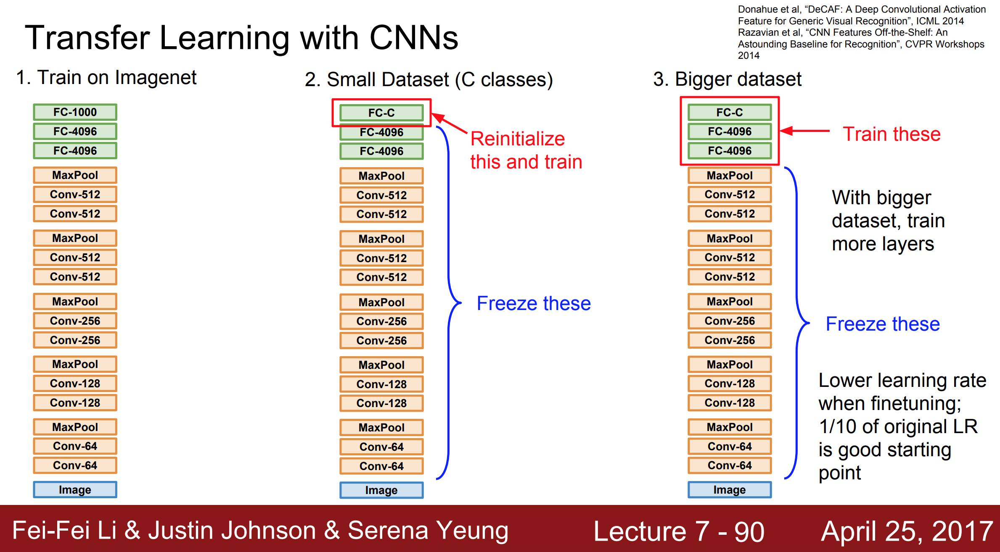
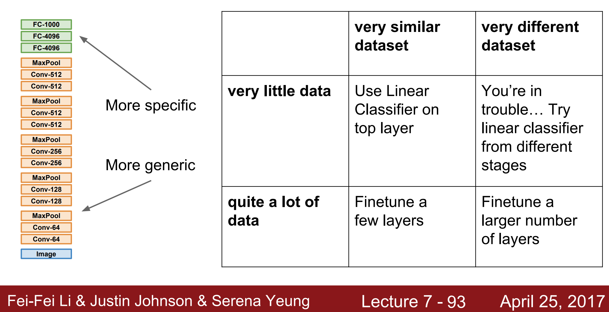
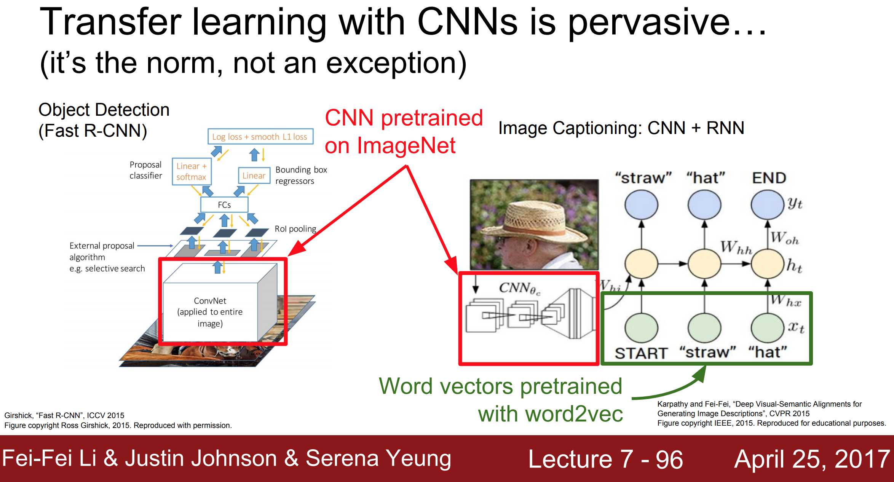

# Learning Enhancement

## Table of Contents

* [Data Augmentation](https://github.com/robert8138/deep-learning-deliberate-practice/blob/master/concepts/learning_enhancement.md#data-augmentation)

* [Model Ensemble](https://github.com/robert8138/deep-learning-deliberate-practice/blob/master/concepts/learning_enhancement.md#model-ensemble)

* [Transfer Learning](https://github.com/robert8138/deep-learning-deliberate-practice/blob/master/concepts/learning_enhancement.md#transfer-learning)
	* [When should one use transfer learning from task A -> B?](https://github.com/robert8138/deep-learning-deliberate-practice/blob/master/concepts/learning_enhancement.md#when-should-one-use-transfer-learning-from-task-a---b)
	* [Different Types of Transfer Learning](https://github.com/robert8138/deep-learning-deliberate-practice/blob/master/concepts/learning_enhancement.md#different-types-of-transfer-learning)
	* [Transfer Learning Visualized](https://github.com/robert8138/deep-learning-deliberate-practice/blob/master/concepts/learning_enhancement.md#transfer-learning-visualized)
	* [Transfer Learning Everywhere](https://github.com/robert8138/deep-learning-deliberate-practice/blob/master/concepts/learning_enhancement.md#transfer-learning-everywhere)

## Data Augmentation

Data Augmentation is especially common in Computer Vision and in CNN. Data augmentation takes the approach of generating more training data from existing training samples, by augmenting the samples via a number of random transformations that yield believable-looking images:

* Location Translation
* Image Rotation
* Stretching, Zooming in, Zooming out
* [Shearing](https://en.wikipedia.org/wiki/Shear_mapping)
* (Anything crazy ...)

In Keras, there are common utils module that allows you to do this. Refer to Francis Chollet's book (chapter 5):

```python
from keras.preprocessing.image import ImageDataGenerator

datagen = ImageDataGenerator(
			rotation_range=40,
			width_shift_range=0.2,   # shift left or right
			height_shift_range=0.2,  # shift up or down
			shear_range=0.2,         # Shearing
			zoom_range=0.2,          # Zooming in, out
			horizontal_flip=True,    # Flip the image
			fill_mode='nearest'      # how newly created pixels will be filled
)
```

## Model Ensemble

In practice, one reliable approach to improving the performance of Neural Networks by a few percent is to train multiple independent models, and at test time average their predictions (this is the same concept as **Bagging**). As the number of models in the ensemble increases, the performance typically monotonically improves (though with diminishing returns). Moreover, the improvements are more dramatic with higher model variety in the ensemble. There are a few approaches to forming an ensemble:

* **Top models discovered during cross-validation**: Use cross-validation to determine the best hyperparameters, then pick the top few (e.g. 10) models to form the ensemble. This improves the variety of the ensemble but has the danger of including suboptimal models. In practice, this can be easier to perform since it doesn’t require additional retraining of models after cross-validation

* **Different checkpoints of a single model**: If training is very expensive, some people have had limited success in taking different checkpoints of a single network over time (for example after every epoch) and using those to form an ensemble. Clearly, this suffers from some lack of variety, but can still work reasonably well in practice. The advantage of this approach is that is very cheap.

* **Running average of parameters during training (Polyak Averaging)**: Related to the last point, a cheap way of almost always getting an extra percent or two of performance is to maintain a second copy of the network’s weights in memory that maintains an exponentially decaying sum of previous weights during training. This way you’re averaging the state of the network over last several iterations. You will find that this “smoothed” version of the weights over last few steps almost always achieves better validation error. The rough intuition to have in mind is that the objective is bowl-shaped and your network is jumping around the mode, so the average has a higher chance of being somewhere nearer the mode.

More generally, we can create a model ensemble by adding noise to the training process, and then average out randomness in test time:


* **Same model, different initializations**: Use cross-validation to determine the best hyperparameters, then train multiple models with the best set of hyperparameters but with different random initialization. The danger with this approach is that the variety is only due to initialization. In this case, `z` is the initial weights.

* **Data Augmentation**: Mentioned above, where we perturb the training data by augmenting with noise. Here, `z` is in the training data.

* **Batch Normalization**: In training time, we normalize the `z`s using stats from random mini-batches. In test time, however, we use the running average of the mean and std. Here `z` is the randomness in mean and std due to the sampling of mini-batches.

* **Dropout**: In training time, we mask out certain activations. In test time, however, we do a complete forward pass of the network. Here, `z` is the random mask that alters the network architecture.

* **DropConnect**: In training time, certain weights are dropped, which caused certain nodes not be connected. At test, we do a complete forward pass of the original network. Here `z` is the random mask of model weights.

* **Fractional Max Pooling**: In training time, we can do fractional maxpooling in different position of the images. At test, we proceed as usual. Here, `z` is the random maxpooling position and area size.

* **Stochastic Depth**: For a deep network like ResNet, because we have the direct connection, at training time we can choose to drop some of the intermediate layers. At test time, we pass through the original network. Here, `z` is that random blocks are removed. 

One disadvantage of model ensembles is that they take longer to evaluate on test example, so if you need to build a production system that requires low latency, this is a consideration. However, for things like Kaggle competition, these ensemble methods are extremely popular.

## Transfer Learning

_Another great resource for this is Andrej Karpathy's [notes](http://cs231n.github.io/transfer-learning/)._

There is a common myth that "“You need a lot of a data if you want to train/use CNNs”". If you are training a model from scratch on a task that has never been done before, then YES. However, in most of real life applications, the tasks that we are trying to solve are similar to many of the previously solved tasks. In such cases, leveraging the work that has been done by others can be extremely powerful, this is the concept beyond "Transfer Learning". 

In fact, this has become so common that different Deep Learning frameworks now offers "model zoo" for people to do transfer learning, see [Caffe](https://github.com/BVLC/caffe/wiki/Model-Zoo), [TensorFlow](https://github.com/tensorflow/models), and [PyTorch](https://github.com/pytorch/vision).

### When should one use transfer learning from task A -> B? 

Here is the general guideline from Andrew Ng:

* Task A and B have the same input X
* If the trained labels for A are similar to the new task labels B
* You have a lot of data from Task A than Task B
* Low level concept from A could be helpful for learning task B

### Different Types of Transfer Learning

* **ConvNet as fixed feature extractor**: Take a ConvNet pretrained on ImageNet, remove the last fully-connected layer (this layer’s outputs are the 1000 class scores for a different task like ImageNet), then treat the rest of the ConvNet as a fixed feature extractor for the new dataset. In an AlexNet, this would compute a 4096-D vector for every image that contains the activations of the hidden layer immediately before the classifier. We call these features CNN codes. It is important for performance that these codes are ReLUd (i.e. thresholded at zero) if they were also thresholded during the training of the ConvNet on ImageNet (as is usually the case). Once you extract the 4096-D codes for all images, train a linear classifier (e.g. Linear SVM or Softmax classifier) for the new dataset. It's worth noting that using pre-trained Word2Vec of GloVec word embeddings for RNN is a similar concept here.

* **Fine-tuning the ConvNet**: The second strategy is to not only replace and retrain the classifier on top of the ConvNet on the new dataset, but to also fine-tune the weights of the pretrained network by continuing the backpropagation. It is possible to fine-tune all the layers of the ConvNet, or it’s possible to keep some of the earlier layers fixed (due to overfitting concerns) and only fine-tune some higher-level portion of the network. This is motivated by the observation that the earlier features of a ConvNet contain more generic features (e.g. edge detectors or color blob detectors) that should be useful to many tasks, but later layers of the ConvNet becomes progressively more specific to the details of the classes contained in the original dataset. In case of ImageNet for example, which contains many dog breeds, a significant portion of the representational power of the ConvNet may be devoted to features that are specific to differentiating between dog breeds.

### Transfer Learning Visualized



* **Remove & Retrain the Last Layer (FC)**: You can simply remove the last layer of a pre-trained model, replace with a new layer with randomly initialized weights for that final layer, then use task B's {x,y} to fine tune the parameters. Appropriate when the training data for B is small. This is the same as the ConNet as fixed feature extractor mentioned above.

* **Remove & Retrain the last few layers**: If you have enough data for task B, you can even go back a few layers, and then retrain the parameters in the last few layers. Appropriate when the training data for task B is moderate.

* **Retrain the entire network, but use pre-trained model as weight initialization**: The final extreme case is to use the pretrained model's weight as weight initialization, then retrain the entire model, so the pre-trained model only serve as weight initialization. Appropriate to use when you have a lot of data for task B.

For all the options above, you can choose to add and extend more layers if you like. For fine tuning, it's generally recommended to use a much smaller learning rate. Also, it's important to make sure that if we are not re-training the previous layer, we have to freeze the layers so we don't do gradient updates on them.

Here is another view of when we should use transfer learning:



### Transfer Learning Everywhere

Finally, remember that this doesn't only applied to CNN, this applies to RNN as well, where we can use off-the-shelf word embeddings to train our models. 

