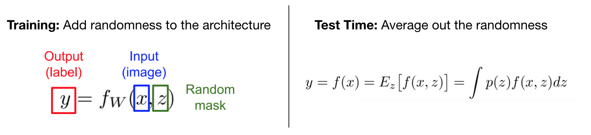

# Learning Enhancement

## Table of Contents

* [Data Augmentation](https://github.com/robert8138/deep-learning-deliberate-practice/blob/master/concepts/learning_enhancement.md#data-augmentation)

* [Model Ensemble](https://github.com/robert8138/deep-learning-deliberate-practice/blob/master/concepts/learning_enhancement.md#model-ensemble)

* [Transfer Learning](https://github.com/robert8138/deep-learning-deliberate-practice/blob/master/concepts/learning_enhancement.md#transfer-learning)

## Data Augmentation

Data Augmentation is especially common in Computer Vision and in CNN. Data augmentation takes the approach of generating more training data from existing training samples, by augmenting the samples via a number of random transformations that yield believable-looking images:

* Location Translation
* Image Rotation
* Stretching, Zooming in, Zooming out
* [Shearing](https://en.wikipedia.org/wiki/Shear_mapping)
* (Anything crazy ...)

In Keras, there are common utils module that allows you to do this. Refer to Francis Chollet's book (chapter 5):

```python
from keras.preprocessing.image import ImageDataGenerator

datagen = ImageDataGenerator(
			rotation_range=40,
			width_shift_range=0.2,   # shift left or right
			height_shift_range=0.2,  # shift up or down
			shear_range=0.2,         # Shearing
			zoom_range=0.2,          # Zooming in, out
			horizontal_flip=True,    # Flip the image
			fill_mode='nearest'      # how newly created pixels will be filled
)
```

## Model Ensemble

In practice, one reliable approach to improving the performance of Neural Networks by a few percent is to train multiple independent models, and at test time average their predictions (this is the same concept as **Bagging**). As the number of models in the ensemble increases, the performance typically monotonically improves (though with diminishing returns). Moreover, the improvements are more dramatic with higher model variety in the ensemble. There are a few approaches to forming an ensemble:

* **Top models discovered during cross-validation**: Use cross-validation to determine the best hyperparameters, then pick the top few (e.g. 10) models to form the ensemble. This improves the variety of the ensemble but has the danger of including suboptimal models. In practice, this can be easier to perform since it doesn’t require additional retraining of models after cross-validation

* **Different checkpoints of a single model**: If training is very expensive, some people have had limited success in taking different checkpoints of a single network over time (for example after every epoch) and using those to form an ensemble. Clearly, this suffers from some lack of variety, but can still work reasonably well in practice. The advantage of this approach is that is very cheap.

* **Running average of parameters during training (Polyak Averaging)**: Related to the last point, a cheap way of almost always getting an extra percent or two of performance is to maintain a second copy of the network’s weights in memory that maintains an exponentially decaying sum of previous weights during training. This way you’re averaging the state of the network over last several iterations. You will find that this “smoothed” version of the weights over last few steps almost always achieves better validation error. The rough intuition to have in mind is that the objective is bowl-shaped and your network is jumping around the mode, so the average has a higher chance of being somewhere nearer the mode.

More generally, we can create a model ensemble by adding noise to the training process, and then average out randomness in test time:



* **Same model, different initializations**: Use cross-validation to determine the best hyperparameters, then train multiple models with the best set of hyperparameters but with different random initialization. The danger with this approach is that the variety is only due to initialization. In this case, `z` is the initial weights.

* **Data Augmentation**: Mentioned above, where we perturb the training data by augmenting with noise. Here, `z` is in the training data.

* **Batch Normalization**: In training time, we normalize the `z`s using stats from random mini-batches. In test time, however, we use the running average of the mean and std. Here `z` is the randomness in mean and std due to the sampling of mini-batches.

* **Dropout**: In training time, we mask out certain activations. In test time, however, we do a complete forward pass of the network. Here, `z` is the random mask that alters the network architecture.

* **DropConnect**: In training time, certain weights are dropped, which caused certain nodes not be connected. At test, we do a complete forward pass of the original network. Here `z` is the random mask of model weights.

* **Fractional Max Pooling**: In training time, we can do fractional maxpooling in different position of the images. At test, we proceed as usual. Here, `z` is the random maxpooling position and area size.

* **Stochastic Depth**: For a deep network like ResNet, because we have the direct connection, at training time we can choose to drop some of the intermediate layers. At test time, we pass through the original network. Here, `z` is that random blocks are removed. 

One disadvantage of model ensembles is that they take longer to evaluate on test example, so if you need to build a production system that requires low latency, this is a consideration. However, for things like Kaggle competition, these ensemble methods are extremely popular.

## Transfer Learning

There is a common myth that "“You need a lot of a data if you want to train/use CNNs”". If you are training a model from scratch on a task that has never been done before, then YES. However, in most of real life applications, the tasks that we are trying to solve are similar to many of the previously solved tasks. In such cases, leveraging the work that has been done by others can be extremely powerful, this is the concept beyond "Transfer Learning".


* Transfer Learning: Don't start from scratch
	* If you have very little data, take trained neural network as is, pop the very last softmax layer while freezing the weights on all prior layers, and impose your own softmax layer with your problem specific labels.
		- Appropriate to use when the new training data is small
		- Good if the trained labels are similar to the new task labels, otherwise might not work well
		- Often useful to precompute the embeddings and save them to disk, then train on new labels

	* Take trained neural network as is, pop the very last **FEW** layers, and retrain the last few layers with the new labels
		- Appropriate to use when you have a larger label dataset
		- By retraining, we can either retrain the last few layers with the same architecture
		- or we can retrain them on with our own architecture for the last few layers

	* Use the same architecture as the pre-trained model, but retrain the entire network
		- Appropriate to use when you have a lot of data
		- Use the pre-trained weights as your initialization weight (and replace the original random initialization), then retrain everything
		- It takes time and computational power/budget


