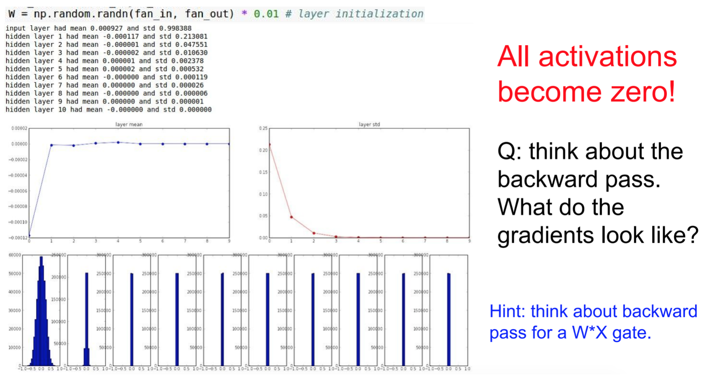
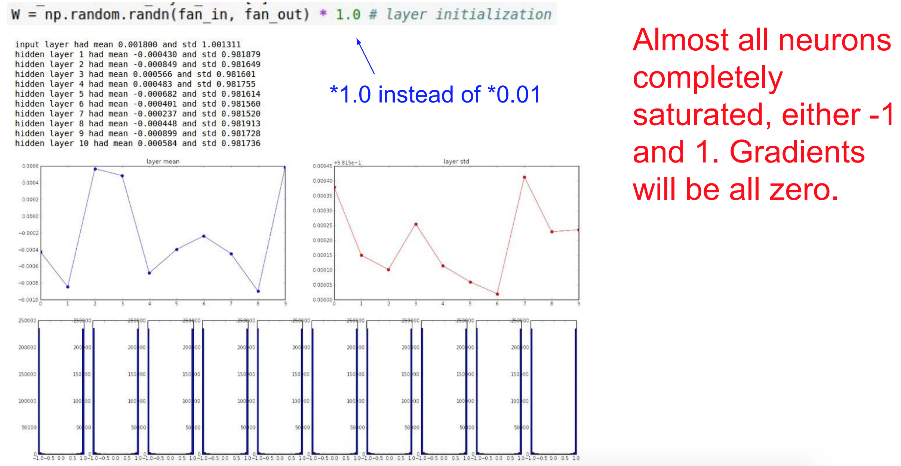
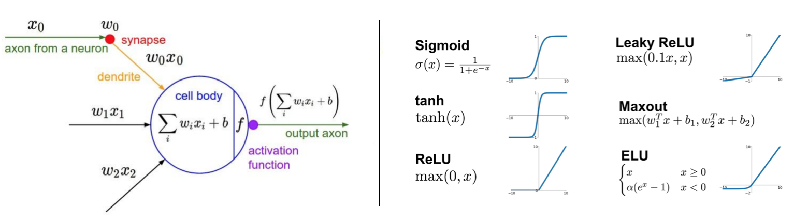
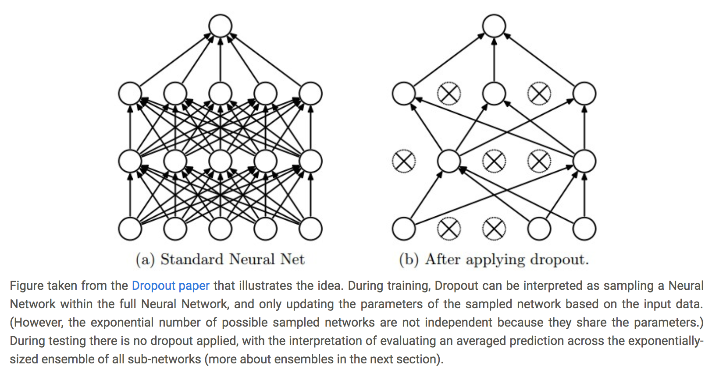
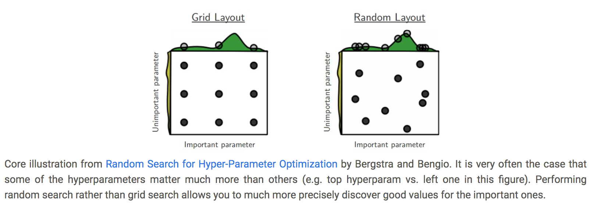

# Optimization Training Tricks

_This section is largely adapt from Andrej Karpathy's CS 231N notes: Training Neural Network [I](http://cs231n.github.io/neural-networks-1/), [II](http://cs231n.github.io/neural-networks-2/), [III](http://cs231n.github.io/neural-networks-3/), all credits belong to him._

## Table of Contents

* [Data Preprocessing (X)](https://github.com/robert8138/deep-learning-deliberate-practice/blob/master/concepts/learning_tricks.md#data-preprocessing): to make X gaussian

* [Weight Initialization (W)](https://github.com/robert8138/deep-learning-deliberate-practice/blob/master/concepts/learning_tricks.md#initialization): to make z & activations gaussian through clever initialization

* [Batch Normalization (Z)](https://github.com/robert8138/deep-learning-deliberate-practice/blob/master/concepts/learning_tricks.md#batch-normalization): explicitly model z to have gaussian shape

* [Activation Function (σ)](https://github.com/robert8138/deep-learning-deliberate-practice/blob/master/concepts/learning_tricks.md#activation-function): good nonlinearity that preserve good behaviors of x,z,a

* [Regularization](https://github.com/robert8138/deep-learning-deliberate-practice/blob/master/concepts/learning_tricks.md#regularization)

* [Hyperparameter Tuning](https://github.com/robert8138/deep-learning-deliberate-practice/blob/master/concepts/learning_tricks.md#hyperparameter-tuning)

* [Other Checks](https://github.com/robert8138/deep-learning-deliberate-practice/blob/master/concepts/learning_tricks.md#other-checks): If implementing learning algorithm from scratch

## Data Preprocessing

There are three common forms of data preprocessing a data matrix `X`, where we will assume that `X` is of size `N x D` (`N` is the number of data, `D` is their dimensionality).

Mean subtraction is the most common form of preprocessing. It involves subtracting the mean across every individual feature in the data, and has the geometric interpretation of centering the cloud of data around the origin along every dimension. In numpy, this operation would be implemented as: `X -= np.mean(X, axis = 0)`.

Normalization refers to normalizing the data dimensions so that they are of approximately the same scale. There are two common ways of achieving this normalization. One is to divide each dimension by its standard deviation, once it has been zero-centered: `(X /= np.std(X, axis = 0))`. Another form of this preprocessing normalizes each dimension so that the min and max along the dimension is -1 and 1 respectively.


**[PCA](http://cs229.stanford.edu/notes/cs229-notes10.pdf) and Whitening** is another form of preprocessing. In this process, the data is first centered as described above. Then, we can compute the covariance matrix that tells us about the correlation structure in the data, then we using SVD to get the eigenbasis, and we project the original data matrix onto these basis to make things orthogonal. Finally, we can use whitening operation takes the data in the eigenbasis and divides every dimension by the eigenvalue to normalize the scale. Geometrically, this corresponds to stretching and squeezing the data into an isotropic gaussian blob.


In practice. We mention PCA/Whitening in these notes for completeness, but these transformations are not used with Convolutional Networks. However, it is very important to zero-center the data, and it is common to see normalization of every pixel as well.

## Weight Initialization

Some optimization algorithms are not iterative by nature and simply solve for a solution point. Other optimization algorithms are iterative by nature but, when applied to the right class of optimization problems, converge to acceptable solutions in an acceptable amount of time regardless of initialization. Deep learning training algorithms usually do not have either of these luxuries. Training algorithms for deep learning models are usually iterative and thus require the user to specify some initial point from which to begin the iterations.

The **key idea** beyond good initialization is that it governs how `z` and `a` activations might behave in the forward pass, and this in terms affect how backprop would work. Ideally, we want them to be gaussian like, so gradient information can flow back.

Here are various initialization scheme:

**(-) All zero initialization**: Lets start with what we should not do. Note that we do not know what the final value of every weight should be in the trained network, but with proper data normalization it is reasonable to assume that approximately half of the weights will be positive and half of them will be negative. A reasonable-sounding idea then might be to set all the initial weights to zero, which we expect to be the “best guess” in expectation. This turns out to be a mistake, because if every neuron in the network computes the same output, then they will also all compute the same gradients during backpropagation and undergo the exact same parameter updates. In other words, there is no source of asymmetry between neurons if their weights are initialized to be the same. This means that different weights will not learn different patterns.

**Note**: Perhaps the only property known with complete certainty is that the initial parameters need to **“break symmetry”** between different units. If two hidden units with the same activation function are connected to the same inputs, then these units must have different initial parameters. If they have the same initial parameters, then a deterministic learning algorithm applied to a deterministic costand model will constantly update both of these units in the same way.

**(+/-) Small random numbers**: The idea is that the neurons are all random and unique in the beginning, so they will compute distinct updates and integrate themselves as diverse parts of the full network. The implementation for one weight matrix might look like `W = 0.01 * np.random.randn(D,H)`, where `randn` samples from a zero mean, unit standard deviation gaussian. The problem is of this approach is that when `W` is small, the activations can become smaller and smaller because of the multiplicative nature of `W1W2W3...x`. This makes all the activations quickly become 0. More importantly, when we compute the local graident `dL/dw = dL/dσ * dσ/dwTx * dwTx/dw = dL/dσ * dσ/dwTx * x`, because `x=0`, we will not update `w`.



**(-) Large random numbers**: This is almost gaurantee to be a disaster, because activations will quickly be saturated, which means that the gradient for the activation will be in the 0 regime. i.e. `dL/dw = dL/dσ * dσ/dwTx * dwTx/dw`, and `dσ/dwTx` will be 0, which again means `w` will not get updated.



**(+) Calibrating the variances with 1/sqrt(n_input)**. One problem with the above suggestion is that the distribution of the outputs from a randomly initialized neuron has a variance that grows with the number of inputs. It turns out that we can normalize the variance of each neuron’s output to 1 by scaling its weight vector by the square root of its fan-in (i.e. its number of inputs). You can see a more detailed mathematical treatment of this from [CS 230](http://cs230.stanford.edu/files/lecture-notes-3.pdf) for the case of tahn activation function.

**(+) Xavier-He Initialization**: set `w = np.random.randn(n) * sqrt(2.0/n)`, which is the state of the art initialization technique.

**Take away**: Initialization for training Deep Learning model can be tricky, having the ability to reason why activations would look like in the a forward pass, and then reason why backward pass would look like given these activations is a very valuable skill.

## Batch Normalization

As we have seen above, the distribution of the `z` and `a` (activations) during the forward pass can have a great impact on how backward propogation works. In the previous sections, we rely on clever initialization to make `z` and `a` behave gaussian like. However, we can also explicitly try to make `z` gaussian like, and this is the idea beyond Batch Normalization.

```
“you want unit gaussian activations? just make them so.”
```

**Intuition**: To make sure that inputs in each layer are somewhat gaussian. The idea is to normalize it, and give it the chance to stay gaussian, or go back to its original form. Usually they stay somewhat guassian, which improves stability in gradient descent. [Andrew's explanation](https://www.coursera.org/learn/deep-neural-network/lecture/4ptp2/normalizing-activations-in-a-network) from Coursera DL course 2 is the best that I have seen so far.


**Take away**:

* Batch Norm improves gradient flow through the network by regulating activations to be gaussian like
* Allows higher learning rates
* Reduces the strong dependence on initialization
* Acts as a form of regularization in a funny way, and slightly reduces the need for dropout, but it's not its intention to act as a regularization method
* At test time, the mean and std used for normalization are usually computed from the training data using running average. It would be a mistake to use the mean & std of the entire dataset, this will cause data leakage

## Activation Function

Activation function are what introduce non-linearity into Neural Network. If we do not apply activation function for each multiplication `Wx`, then we would just end up with a giant linear transformation `W1W2W3...Wk * x`, this would greatly reduce the expressive power of the model to learn complex patterns. 



There are many different choices of activation functions:

* **Sigmoid**: The sigmoid non-linearity takes a real-valued number and “squashes” it into range between 0 and 1. The sigmoid function has seen frequent use historically since it has a nice interpretation as the firing rate of a neuron: from not firing at all (0) to fully-saturated firing at an assumed maximum frequency (1). It has recently fallen out of favor for the following reasons:
	* (-) Recall that during backpropagation for `w`, (local) gradient will be multiplied to the gradient of this gate’s output for the whole objective `dL/dw = dL/dσ (objective w.r.t gate) * dσ/dwTx (local) * dwTx/dw`. If the local gradient is very small or 0 because it's saturated, it will effectively “kill” the gradient and almost no signal will flow through the neuron to its weights and recursively to its data, so `w` will not be updated because `dL/dw = 0`.
	* (-) Also, result of sigmoid is always between [0,1] and is positive. This means that when we do gradient update on w: `dL/dw = dL/dσ * dσ/dwTx * dwTx/dw = dL/dσ * dσ/dwTx * x`, then if x is always positive, then the sign / direction `w` can be is always the sign of `dL/dσ * dσ/dwTx`, which restrict the directions that w can move to its optimal direction. See 231N [lecture 6 notes](http://cs231n.stanford.edu/slides/2017/cs231n_2017_lecture6.pdf) for a detailed explanation.
	* (-) Also, exponential operation is just expensive to calculate.

* **Tanh**: It squashes a real-valued number to the range [-1, 1].
	* (+) Unlike the sigmoid neuron its output is zero-centered. Therefore, in practice the tanh non-linearity is always preferred to the sigmoid nonlinearity.
	* (-) Like the sigmoid neuron, its activations can saturate, so the gradient can get killed for the same reasoning above.

* **RELU**: The Rectified Linear Unit has become very popular in the last few years. It computes the function `f(x)=max(0,x)`. In other words, the activation is simply thresholded at zero. There are several pros and cons to using the ReLUs:
	* (+) It was found to greatly accelerate (e.g. a factor of 6 in Krizhevsky et al.) the convergence of stochastic gradient descent compared to the sigmoid/tanh functions. It is argued that this is due to its linear, non-saturating form.
	* (+) Compared to tanh/sigmoid neurons that involve expensive operations (exponentials, etc.), the ReLU can be implemented by simply thresholding a matrix of activations at zero.
	* (-) It's not zero-centered, so it has the same problem as sigmoid activatio function.
	* (-) Unfortunately, ReLU units can still be fragile during training and can “die”, because half of the regime has graident `0` when `wTx < 0`, so `dL/dw = dL/dσ * dσ/dwTx * dwTx/dw = dL/dσ * 0 * dwTx/dw` can still die. In the unfortunate case where we have bad initialization for w where `wTx < 0`, then the unit will remained dead during training.

* **Leaky RELU**: Leaky ReLUs are one attempt to fix the “dying ReLU” problem. Instead of the function being zero when x < 0, a leaky ReLU will instead have a small negative slope (of 0.01, or so). That is, the function computes `f(x)=𝟙(x<0)(αx)+𝟙(x>=0)(x)` where α is a small constant. Some people report success with this form of activation function, but the results are not always consistent.

* **Maxout**: Generalize RELU and leaky RELU, linear regime, does not saturate, does not die! But double the parameters.

**Take away**: Use ReLU. Be careful with your learning rates. Try out Leaky ReLU / Maxout / ELU. Try out tanh but don’t expect much, and don't use sigmoid.

## Regularization

How do we decide on what architecture to use when faced with a practical problem? Should we use no hidden layers? One hidden layer? Two hidden layers? How large should each layer be? First, note that as we increase the size and number of layers in a Neural Network, the capacity of the network increases. That is, the space of representable functions grows since the neurons can collaborate to express many different functions.

However, increased capacity is both a blessing (since we can learn to classify more complicated data) and a curse (since it is easier to overfit the training data). Overfitting occurs when a model with high capacity fits the noise in the data instead of the (assumed) underlying relationship.

Based on our discussion above, it seems that smaller neural networks can be preferred if the data is not complex enough to prevent overfitting. However, this is incorrect - there are many other preferred ways to prevent overfitting in Neural Networks that we will discuss later (such as L2 regularization, dropout, input noise). In practice, it is always better to use these methods to control overfitting instead of the number of neurons.

The subtle reason behind this is that smaller networks are harder to train with local methods such as Gradient Descent: It’s clear that their loss functions have relatively few local minima, but it turns out that many of these minima are easier to converge to, and that they are bad (i.e. with high loss). Conversely, bigger neural networks contain significantly more local minima, but these minima turn out to be much better in terms of their actual loss. 

In practice, what you find is that if you train a small network the final loss can display a good amount of variance - in some cases you get lucky and converge to a good place but in some cases you get trapped in one of the bad minima. On the other hand, if you train a large network you’ll start to find many different solutions, but the variance in the final achieved loss will be much smaller. In other words, all solutions are about equally as good, and rely less on the luck of random initialization. That's why it's always recommend for Deep Learning, you should try to overfit your model, then regularize.

* **L2 Regularization**: L2 regularization is perhaps the most common form of regularization. It can be implemented by penalizing the squared magnitude of all parameters directly in the objective. That is, for every weight w in the network, we add the term `1/2λw2` to the objective, where `λ` is the regularization strength. It is common to see the factor of 1/2 in front because then the gradient of this term with respect to the parameter `w` is simply `λw` instead of `2λw`. The L2 regularization has the intuitive interpretation of heavily penalizing peaky weight vectors and preferring small weight vectors. In gradient descent, L2 regularization has the effect that every weight is decayed linearly: `W += -lambda * W` towards zero.

* **L1 Regularization**: Another relatively common form of regularization, where for each weight w we add the term λ∣w∣ to the objective. It is possible to combine the L1 regularization with the L2 regularization: λ1∣w∣+λ2w2 (this is called Elastic net regularization). The L1 regularization has the intriguing property that it leads the weight vectors to become sparse during optimization (i.e. very close to exactly zero). If you are not concerned with explicit feature selection, L2 regularization can be expected to give superior performance over L1.

* **Dropout**: An extremely effective method complement to the methods mentioned above. While training, dropout is implemented by only keeping a neuron active with some probability p (a hyperparameter), or setting it to zero otherwise. In actual coding, we can usually apply a mask to the activations. Some implementation detail: in coding dropout, we usually use `inverted dropout`, where in training time we code `H1 = np.maximum(0, np.dot(W1, X) + b1); U1 = (np.random.rand(*H1.shape) < p) / p # first dropout mask. Notice /p! H1 *= U1 # drop!`. This has the advantage that at test time we don't have to do scaling and the prediction code can be left untouched even when we need to adjust dropout rate in training time.



**Theme of noise in forward pass**: Dropout falls into a more general category of methods that introduce stochastic behavior in the forward pass of the network. During testing, the noise is marginalized over analytically (as is the case with dropout when multiplying by p), or numerically (e.g. via sampling, by performing several forward passes with different random decisions and then averaging over them).

**Take away**: In practice: It is most common to use a single, global L2 regularization strength that is cross-validated. It is also common to combine this with dropout applied after all layers. The value of p=0.5 is a reasonable default, but this can be tuned on validation data.

## Hyperparameter Tuning

As we’ve seen, training Neural Networks can involve many hyperparameter settings. The most common hyperparameters in context of Neural Networks include:

* the initial learning rate
* learning rate decay schedule (such as the decay constant)
* regularization strength (L2 penalty, dropout strength)

But as we saw, there are many more relatively less sensitive hyperparameters, for example in per-parameter adaptive learning methods, the setting of momentum and its schedule, etc. In this section we describe some additional tips and tricks for performing the hyperparameter search:

* **Hyperparameter ranges**: Search for hyperparameters on log scale. For example, a typical sampling of the learning rate would look as follows: `learning_rate = 10 ** uniform(-6, 1)`. That is, we are generating a random number from a uniform distribution, but then raising it to the power of 10. The same strategy should be used for the regularization strength. Intuitively, this is because learning rate and regularization strength have multiplicative effects on the training dynamics. For example, a fixed change of adding 0.01 to a learning rate has huge effects on the dynamics if the learning rate is 0.001, but nearly no effect if the learning rate when it is 10. This is because the learning rate multiplies the computed gradient in the update. Therefore, it is much more natural to consider a range of learning rate multiplied or divided by some value, than a range of learning rate added or subtracted to by some value. Some parameters (e.g. dropout) are instead usually searched in the original scale (e.g. dropout = uniform(0,1)).

* **Prefer random search to grid search**: As argued by Bergstra and Bengio in Random Search for Hyper-Parameter Optimization, “randomly chosen trials are more efficient for hyper-parameter optimization than trials on a grid”. As it turns out, this is also usually easier to implement.



* **Stage your search from coarse to fine**: In practice, it can be helpful to first search in coarse ranges (e.g. 10 ** [-6, 1]), and then depending on where the best results are turning up, narrow the range. Also, it can be helpful to perform the initial coarse search while only training for 1 epoch or even less, because many hyperparameter settings can lead the model to not learn at all, or immediately explode with infinite cost. The second stage could then perform a narrower search with 5 epochs, and the last stage could perform a detailed search in the final range for many more epochs (for example).

## Other Checks

### Check Gradient Implementation

If you are implementing your own gradient differentiation (nowadays rare), you should do gradient checking, which is summarized in details [here](http://cs231n.github.io/neural-networks-3/#gradcheck).

### Check Loss Function Implementation

**Look for correct loss at chance performance**: Make sure you’re getting the loss you expect when you initialize with small parameters. It’s best to first check the data loss alone (so set regularization strength to zero). For example, for CIFAR-10 with a Softmax classifier we would expect the initial loss to be 2.302, because we expect a diffuse probability of 0.1 for each class (since there are 10 classes), and Softmax loss is the negative log probability of the correct class so: -ln(0.1) = 2.302.

As a second sanity check, increasing the regularization strength should increase the loss

As a third sanity check, overfit a tiny subset of data: before training on the full dataset try to train on a tiny portion (e.g. 20 examples) of your data and make sure you can achieve zero cost. For this experiment it’s also best to set regularization to zero, otherwise this can prevent you from getting zero cost. Unless you pass this sanity check with a small dataset it is not worth proceeding to the full dataset.

### Histogram of Activations

An incorrect initialization can slow down or even completely stall the learning process. Luckily, this issue can be diagnosed relatively easily. One way to do so is to plot activation/gradient histograms for all layers of the network. Intuitively, it is not a good sign to see any strange distributions - e.g. with tanh neurons we would like to see a distribution of neuron activations between the full range of [-1,1], instead of seeing all neurons outputting zero, or all neurons being completely saturated at either -1 or 1.