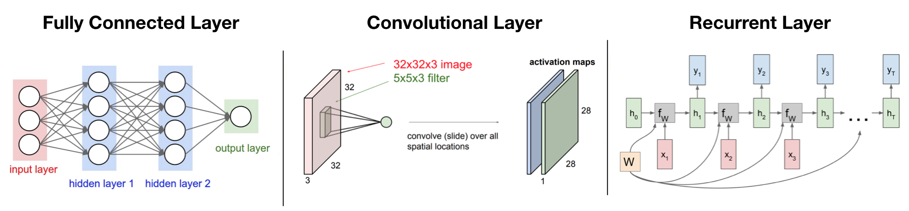
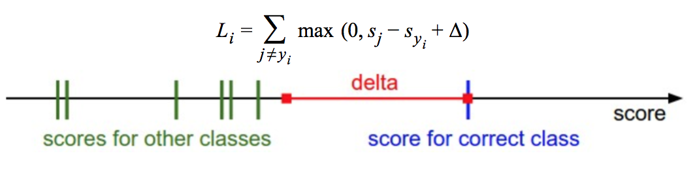
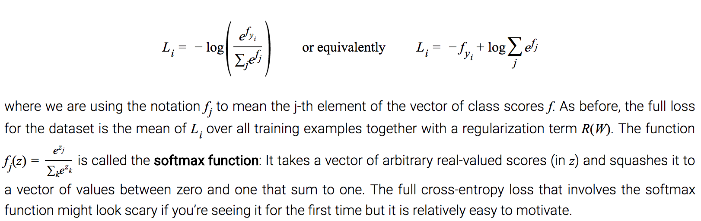
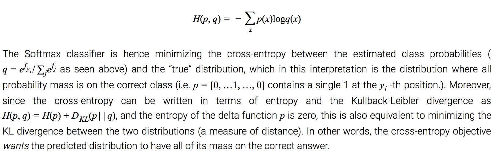
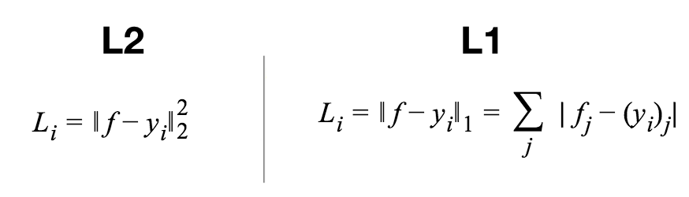

# Neural Network Architecture Basics

Deep Neural Network Architecture typically has a few important component: layers, weights, loss function. In this section, we will briefly describe each, notes are adapted from Andrej Karpathy's CS 231N notes.

## Table of Contents

* [Architecture](https://github.com/robert8138/deep-learning-deliberate-practice/blob/master/concepts/neural_network_architecture_basics.md#architecture)
	* [Layers](https://github.com/robert8138/deep-learning-deliberate-practice/blob/master/concepts/neural_network_architecture_basics.md#layers)
	* [Weights](https://github.com/robert8138/deep-learning-deliberate-practice/blob/master/concepts/neural_network_architecture_basics.md#weights)
	* [Output Layers](https://github.com/robert8138/deep-learning-deliberate-practice/blob/master/concepts/neural_network_architecture_basics.md#output-layers)

* [Loss Function](https://github.com/robert8138/deep-learning-deliberate-practice/blob/master/concepts/neural_network_architecture_basics.md#loss-function)
	* [Thinking About Loss Function]()
	* [Common Loss Function for Classification](https://github.com/robert8138/deep-learning-deliberate-practice/blob/master/concepts/neural_network_architecture_basics.md#common-classification-loss-function-i-cross-entropy-loss)
	* [Common Loss Function for Regression](https://github.com/robert8138/deep-learning-deliberate-practice/blob/master/concepts/neural_network_architecture_basics.md#common-regression-loss-function-i-rmse)

## Architecture

Neural Networks are modeled as collections of neurons that are connected in an acyclic graph, organized in layers. The outputs of some neurons can become inputs to other neurons, and cycles are not allowed since that would imply an infinite loop in the forward pass of a network.

**Naming conventions**: Notice that when we say `N-layer` neural network, we do not count the input layer, but we do count the output layer. Therefore, a single-layer neural network describes a network with no hidden layers (input directly mapped to output, and output being the only layer). In that sense, you can sometimes hear people say that logistic regression or SVMs are simply a special case of single-layer Neural Networks.

### Layers

For regular neural networks, the most common layer type is the **fully-connected layer (FC)** in which neurons between two adjacent layers are fully pairwise connected, but neurons within a single layer share no connections. For networks like CNN, we have **convolutional layers (CONV)** where only neighboring neurons would share the same parameters (image kernel), which reduces the number of parameters. In networks like RNN, the same parameters (weight matrix) can be used repeatedly in different time during training.

For detailed treatment of CNN and RNN, please refer to [convolution_neural_network.md](https://github.com/robert8138/deep-learning-deliberate-practice/blob/master/concepts/convolutional_neural_network.md) and [necurrent_neural_network.md](https://github.com/robert8138/deep-learning-deliberate-practice/blob/master/concepts/recurrent_neural_network.md). Here, we will focus on regular neural network and high level concepts.

### Weights

It is worth noting, depending on the type of layers you have in your architecture, the model parameters (i.e. weight matrix) would be different.

* **Regular Neural Network**: with FC layers have weight matrix of dimension `N_output x N_input`. We take hidden units of size `N_input`, multiply by weight matrix `W`, to get `N_output` hidden units in the next layer.

* **Convolutional NN**: with CONV layers have "filters" (1 or more in each layer) that takes input volume into a output volume (visually, think of them as boxes -> boxes rather than hideen units -> hidden units). The size of the filters determines how many local structure each filter will capture. For each filter, we will then convolve the filter along the width and height of the input volume. Each convolution operation for each filter will create a feature map, for k times (where k is the number of filters). The final combined feature map becomes the output volume.

* **Recurrent NN**: with Recurrent layers have the same weight matrix being used across time. The unique thing about weight matrix in RNN is that they take in a hidden state `h` and the current time indexed `x` to compute the next hidden state. The final output usually take `hT` at time step `T`, transform by `W_hy` to get the final `y`.

### Output Layers

**Output layer**: Unlike all layers in a Neural Network, the output layer neurons most commonly do not have an activation function (or you can think of them as having a linear identity activation function). This is because the last output layer is usually taken to represent the class scores (e.g. in classification), which are arbitrary real-valued numbers, or some kind of real-valued target (e.g. in regression).

## Loss Function

Loss function is extremely important because it sets up the objective function for the learning algorithm. If the objective is not set up correctly, no amount of training or generalization error will help us because we are not solving the right problems. 

### Thinking About Loss Function

To motivate the discussion with loss function, we can use the `Multiclass Support Vector Machine (SVM) loss` to demonstrate how to reason with what loss function is trying to capture.

This is a classification problem, and we want the correct class to have the highest score, compared to the score of the others (`sj-sy` part). Not only that, we want the score of the correct class to be at least as big as the score of the other classes, and a penalty will incur if this is not the case (`sj_sy + \delta` part). Finally, we use `max(0, -)`, also called **hinge loss** to capture that if score of the incorrect classes are smaller than a margin, then no cost is incur, otherwise, the cost is positive. This type of reasoning is the core of how we construct and think about loss functions.

The takeaway from this section is that the SVM loss takes one particular approach to measuring how consistent the predictions on training data are with the ground truth labels. Additionally, making good predictions on the training set is equivalent to minimizing the loss.

### Common Classification Loss Function I: Cross-Entropy Loss

In the Softmax classifier, the function mapping `f(xi; W) = WTxi` stays unchanged, but we now interpret these scores as the unnormalized log probabilities for each class and replace the hinge loss with a cross-entropy loss that has the form:

It is worth discussing how the name **cross-entropy** loss came about, and this is from information theory. Recall that in information theory, the cross-entropy between a "true" distribution `p` and an estimated distribution `q` is defined as:

It's also important to remember that the normalized score from softmax should be considered as a "confidence" score rather than a true probability. This is because depending on how much regularization we put on the model, it will change the probabilities. Hence, the probabilities computed by the Softmax classifier are better thought of as confidences where, similar to the SVM, the ordering of the scores is interpretable, but the absolute numbers (or their differences) technically are not. See [here](http://cs231n.github.io/linear-classify/#svmvssoftmax) for more details.

#### Multi-class Clasification Problem (a.k.a Attribute Classification)

Sometimes the examples can fall under multiple categories, so it need not just fall into one category. For example, images on Instagram can be thought of as labeled with a certain subset of hashtags from a large set of all hashtags. In this case, a sensible approach would be to build a binary classifier for every single attribute independently. In this case, we can either use the hinge loss or the binary-entropy loss for each attribute.

### Common Regression Loss Function I: RMSE

**Regression** is the task of predicting real-valued quantities, such as the price of houses or the length of something in an image. For this task, it is common to compute the loss between the predicted quantity and the true answer and then measure the L2 squared norm, or L1 norm of the difference.

**Word of caution**: When faced with a regression task, first consider if it is absolutely necessary. Instead, have a strong preference to discretizing your outputs to bins and perform classification over them whenever possible.

