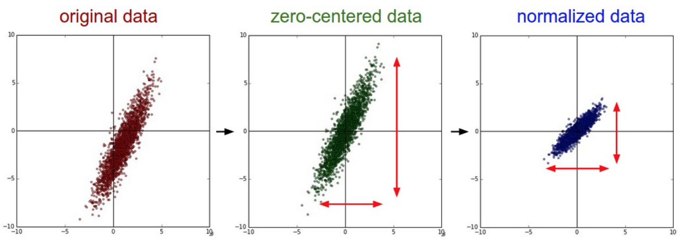
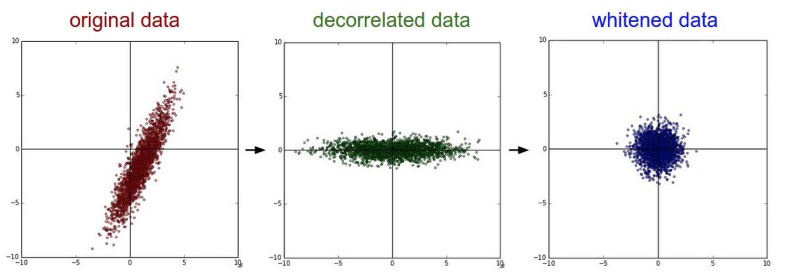
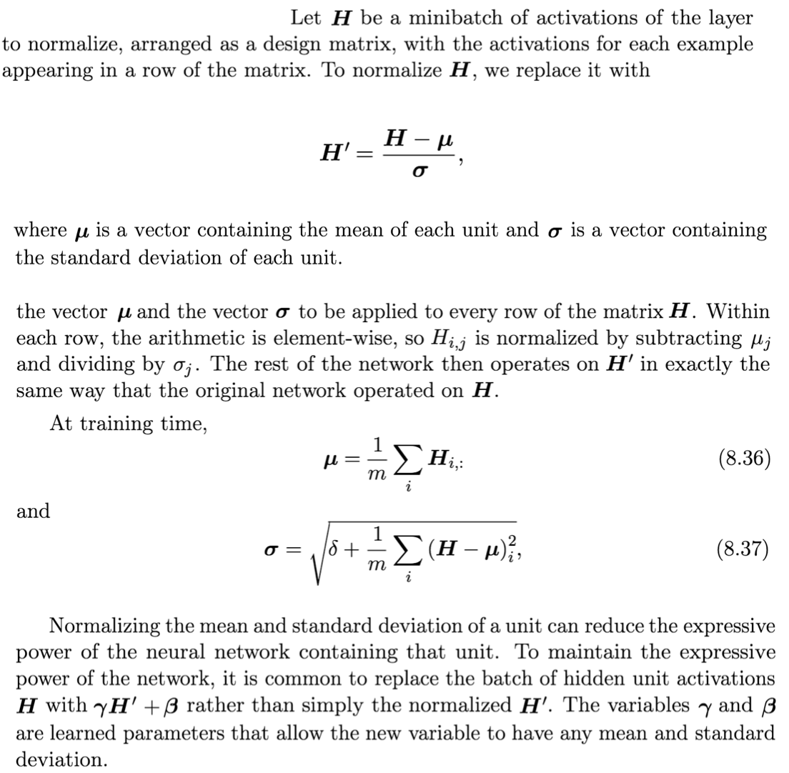

# Optimization Tricks

_This section is largely adapt from Andrej Karpathy's CS 231N notes: Training Neural Network [I](http://cs231n.github.io/neural-networks-1/), [II](http://cs231n.github.io/neural-networks-2/), [III](http://cs231n.github.io/neural-networks-3/)._

## Table of Contents

* [Data Preprocessing](https://github.com/robert8138/deep-learning-deliberate-practice/blob/master/concepts/optimization.md#data-preprocessing)

* [Weight Initialization](https://github.com/robert8138/deep-learning-deliberate-practice/blob/master/concepts/optimization.md#initialization)

* [Batch Normalization](https://github.com/robert8138/deep-learning-deliberate-practice/blob/master/concepts/optimization.md#batch-normalization)

* [Dropout](https://github.com/robert8138/deep-learning-deliberate-practice/blob/master/concepts/optimization.md#dropout)

* [Hyperparameter Tuning](https://github.com/robert8138/deep-learning-deliberate-practice/blob/master/concepts/optimization.md#hyperparameter-tuning)

## Data Preprocessing

There are three common forms of data preprocessing a data matrix `X`, where we will assume that `X` is of size `N x D` (`N` is the number of data, `D` is their dimensionality).

Mean subtraction is the most common form of preprocessing. It involves subtracting the mean across every individual feature in the data, and has the geometric interpretation of centering the cloud of data around the origin along every dimension. In numpy, this operation would be implemented as: `X -= np.mean(X, axis = 0)`.

Normalization refers to normalizing the data dimensions so that they are of approximately the same scale. There are two common ways of achieving this normalization. One is to divide each dimension by its standard deviation, once it has been zero-centered: `(X /= np.std(X, axis = 0))`. Another form of this preprocessing normalizes each dimension so that the min and max along the dimension is -1 and 1 respectively.

**PCA and Whitening** is another form of preprocessing. In this process, the data is first centered as described above. Then, we can compute the covariance matrix that tells us about the correlation structure in the data, then we using SVD to get the eigenbasis, and we project the original data matrix onto these basis to make things orthogonal. Finally, we can use whitening operation takes the data in the eigenbasis and divides every dimension by the eigenvalue to normalize the scale. Geometrically, this corresponds to stretching and squeezing the data into an isotropic gaussian blob.

## Weight Initialization

Some optimization algorithms are not iterative by nature and simply solve for a solution point. Other optimization algorithms are iterative by nature but, when applied to the right class of optimization problems, converge to acceptable solutions in an acceptable amount of time regardless of initialization. Deep learning training algorithms usually do not have either of these luxuries. Training algorithms for deep learning models are usually iterative and thus require the user to specify someinitial point from which to begin the iterations.

**Pitfall: all zero initialization**. Lets start with what we should not do. Note that we do not know what the final value of every weight should be in the trained network, but with proper data normalization it is reasonable to assume that approximately half of the weights will be positive and half of them will be negative. A reasonable-sounding idea then might be to set all the initial weights to zero, which we expect to be the “best guess” in expectation. This turns out to be a mistake, because if every neuron in the network computes the same output, then they will also all compute the same gradients during backpropagation and undergo the exact same parameter updates. In other words, there is no source of asymmetry between neurons if their weights are initialized to be the same. This means that different weights will not learn different patterns.

Perhaps the only property known with complete certainty is that the initial parameters need to “break symmetry” between different units. If two hidden units with the same activation function are connected to the same inputs, then these units must have different initial parameters. If they have the same initial parameters, then a deterministic learning algorithm applied to a deterministic costand model will constantly update both of these units in the same way.

A common technique in initialization is normalization of weights. The idea is that the neurons are all random and unique in the beginning, so they will compute distinct updates and integrate themselves as diverse parts of the full network. The implementation for one weight matrix might look like `W = 0.01 * np.random.randn(D,H)`, where `randn` samples from a zero mean, unit standard deviation gaussian.

**Calibrating the variances with 1/sqrt(n)**. One problem with the above suggestion is that the distribution of the outputs from a randomly initialized neuron has a variance that grows with the number of inputs. It turns out that we can normalize the variance of each neuron’s output to 1 by scaling its weight vector by the square root of its fan-in (i.e. its number of inputs). More recently, people follow the **Xavier-He Initialization**, which says `w = np.random.randn(n) * sqrt(2.0/n)`.

## Batch Normalization

**Intuition**: To make sure that inputs in each layer are somewhat gaussian. The idea is to normalize it, and give it the chance to stay gaussian, or go back to its original form. Usually they stay somewhat guassian, which improves stability in gradient descent. [Andrew's explanation](https://www.coursera.org/learn/deep-neural-network/lecture/4ptp2/normalizing-activations-in-a-network) from Coursera DL course 2 is the best that I have seen so far.

## Dropout

## Hyperparameter Tuning
