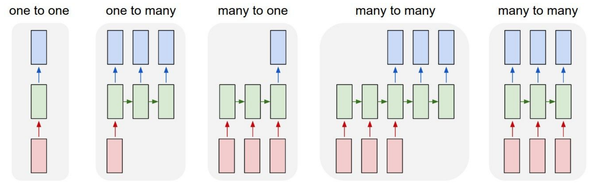
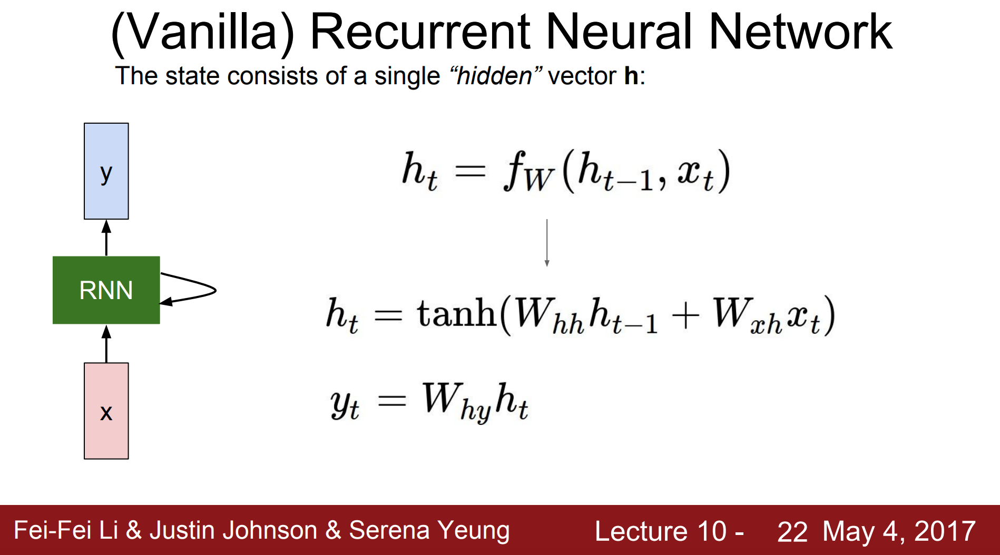
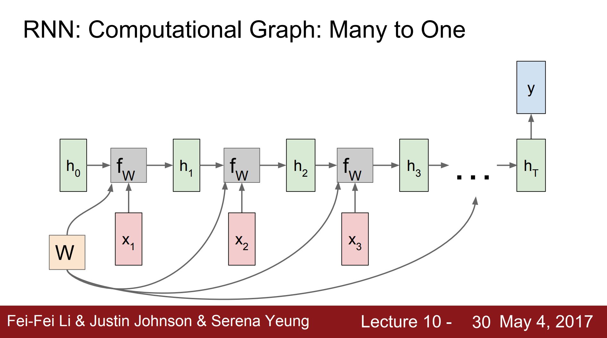
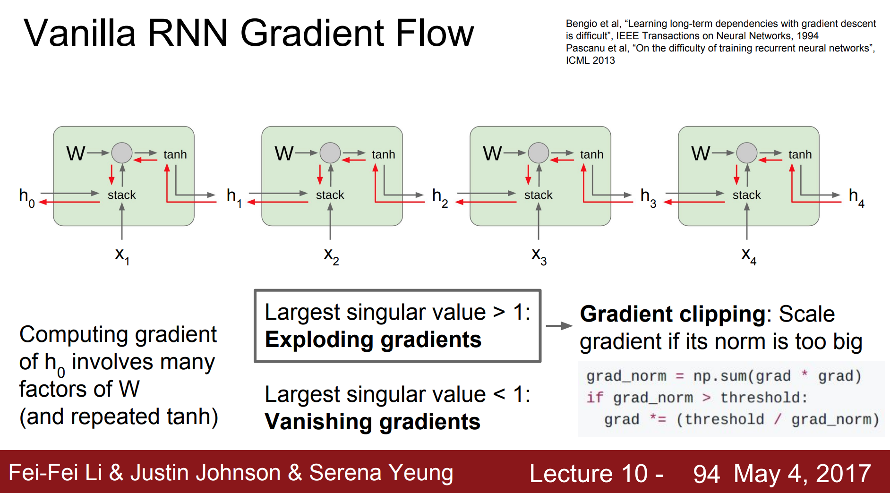
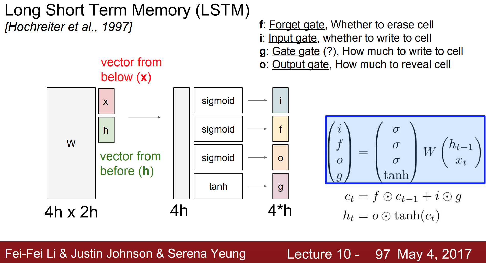
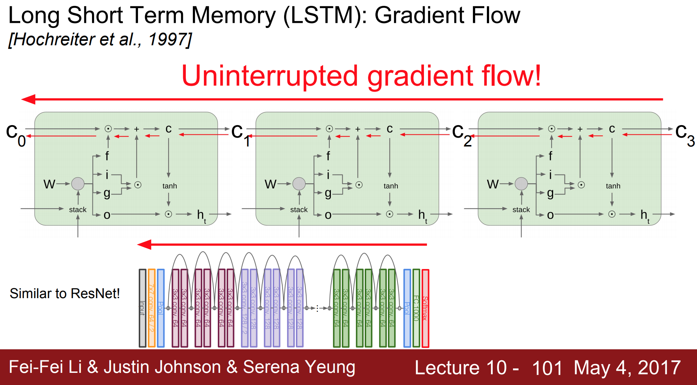
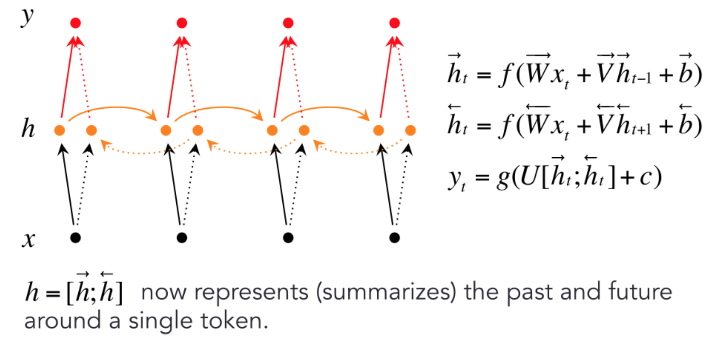
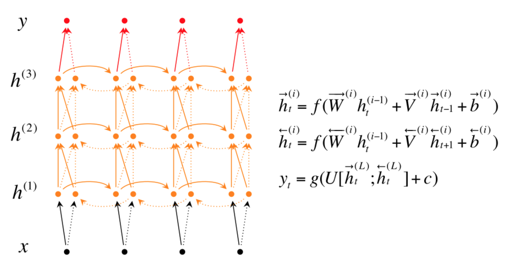

# Recurrent Neural Network

## Table of Contents

* [Different Formulations](https://github.com/robert8138/deep-learning-deliberate-practice/blob/master/CONCEPTS.md#different-formulations)
* [Vanilla RNN](https://github.com/robert8138/deep-learning-deliberate-practice/blob/master/CONCEPTS.md#vanilla-rnn)
* [Vanilla RNN Backward Propogation Through Time](https://github.com/robert8138/deep-learning-deliberate-practice/blob/master/CONCEPTS.md#vanilla-rnn-backward-propogation-through-time)
* [Vanilla RNN: Character-level Language Modeling Sampling](https://github.com/robert8138/deep-learning-deliberate-practice/blob/master/CONCEPTS.md#vanilla-rnn-character-level-language-modeling-sampling)
* [Exploding/Vanishing Gradient Problem](https://github.com/robert8138/deep-learning-deliberate-practice/blob/master/CONCEPTS.md#explodingvanishing-gradient-problem)
* [Long, Short Term Memory (LSTM)](https://github.com/robert8138/deep-learning-deliberate-practice/blob/master/CONCEPTS.md#long-short-term-memory-lstm)
* [Other Ways to Make RNN more powerful (Bidirectioanal RNN, Deep RNN)](https://github.com/robert8138/deep-learning-deliberate-practice/blob/master/CONCEPTS.md#other-ways-to-make-rnn-more-powerful-bidirectioanal-rnn-deep-rnn)

## Different Formulations

Recurrent Neural Network (RNN), unlike Convolutional Neural Network, are typically applied to sequence data, and can take in different forms:

* **one-to-one**: image -> classification (typical vanilla neural network)
* **one-to-many**: image -> sequence of words (Image captioning)
* **many-to-one**: sequence of words -> sentiment (Sentiment classification)
* **many-to-many**: sequence of words in English -> sequence of words in French (Machine Translation)
* **many-to-many**: sequence of video frames -> scene detection (Video classification on frame level)

## Vanilla RNN

To learn RNN, it's usually good to start with vanilla recurrent neural network (RNN). The formulation `f` takes in `X_t` as inputs, and tranform them to `h_t` via parameter `W_hh` and `W_hx`. The final output `y` is computed from `h_t` via a linear transformation on parameter `W_hy`. See pictures below:

The unfold version of vanilla RNN, in my opinion, is the best representation of what vanilla RNN is doing under the hood. It's important to note that the `W` parameter matrices are **reused** in each timestamp. Below is a picture for many-to-one setup:

## Vanilla RNN Backward Propogation Through Time

One detail about backprop in Vanilla RNN is that we don't update the graident in every timestamp. Instead, we let the model run in **time batches**, then do a one time update every batch:

## Vanilla RNN: Character-level Language Modeling Sampling

One really interesting application of Vanilla RNN (one-to-many) is the character-level language modeling. In this model, you start with a "seed" character as input layer -> hidden layer -> output layer -> sample from output layer distribution ... then you repeat the same process again and again:

This kind of approach will yield a few amazing, fun, applications. Andrej Karpathy applied this char RNN model -> {Paul Graham essays, Shakespeare, LaTex, C, Linux}, and they are pretty amazing:

* [The Unreasonable Effectiveness of Recurrent Neural Networks](http://karpathy.github.io/2015/05/21/rnn-effectiveness/)

These models can be really fun, but they also have real-life applications. For example, when combining CNN with character-level language RNN, we can bild a image captioning system. A few technical details: 

* It's entirely possible to build an end-to-end image captioning system = CNN (image -> embedding) + RNN (embedding -> captions)
* The whole m-RNN architecture contains a language model part, an image part and a multimodal part. The language model part learns the dense feature embedding for each word in the dictionary and stores the semantic temporal context in recurrent layers. The image part contains a deep Convulutional Neural Network (CNN) [17] which extracts image features. The multimodal part connects the language model and the deep CNN together by a one-layer representation. The [paper](https://arxiv.org/pdf/1410.1090.pdf) describes this in details (the paper is pretty accessible).

## Exploding/Vanishing Gradient Problem

It has been [researched](http://www.iro.umontreal.ca/~lisa/pointeurs/ieeetrnn94.pdf) that when RNN has a long-term time dependency, passing the gradient back to earlier hidden states can be difficult. Intuitively, this is because by the time that we go back to the earlier part of RNN, we have already multiply by a lot of `W` parameters. There are typically two scenarios:

* **Exploding Gradient**: where the gradient becomes way too big, and our update step becomes too big, and the network loss just blow up. For this scenario, the current solution (somewhat hacky) is to use gradient clipping.

* **Vanishing Gradient**: where the gradient becomes smaller and smaller when multiply by our `W`, the solution for this is to use a different architecture, similar to how ResNet does it (i.e. provide a freeway for identify gradient to pass through).

## Long, Short Term Memory (LSTM)

LSTM was developed in 1997, but has become very popular because it addresses the vanishing gradient problem we described earlier. The key ideas is that we have a new cell `c` called **memory cell**, that tracks of everything that we learned so far. In particular, there are few additional gates:

* **Forget Gate**: How much of memory cell `c_t-1` from last time step to forget / retain
* **Input Gate**: How much of new candidate memory `c_t^hat` to use
* **Output Gate**: How much final candidate memory `c_t` to output

Of all the treatment of this topic, I think Edwin Chen's tutorial on LSTM is by far the best, and most entertaining. In particular, he remember focused on how to visualize what the gates are doing, memorizing, or capturing.

* [Edwin Chen's explanation on LSTM with visualization](http://blog.echen.me/2014/05/30/exploring-lstms/)

The key thing to remember is that with this formulation, gradient can flow a lot easier along the network.

## Other Ways to Make RNN more powerful (Bidirectioanal RNN, Deep RNN)

There are other ways to make RNNs even more powerful, the two notable ones are:

* [Bidirectional RNN](https://www.coursera.org/learn/nlp-sequence-models/lecture/fyXnn/bidirectional-rnn): Sometimes we want to incorporate information that's not necessarily directional (e.g. You want to use information from the future). For example, it would be helpful if we can consider all information surrounding a center word. Bidirectional RNN can really help. The key here is that we will have two hidden states (`h_forward`, and `h_backward`) at any time `t`, the two hidden states will be used to compute `y`. 

* [Deep RNN](https://www.coursera.org/learn/nlp-sequence-models/lecture/ehs0S/deep-rnns): For learning very complex function, sometimes it's useful to stack RNN with more layers. The key difference here is that for `ht`, it's computed from `h_t-1` from current layer + `h_t` from previous layer.

These techniques can be applied to vanilla RNN blocks, GRU blocks, or LSTM blocks.