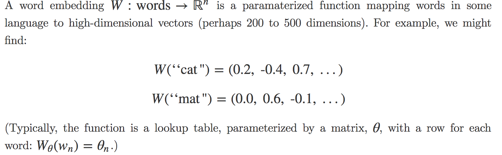
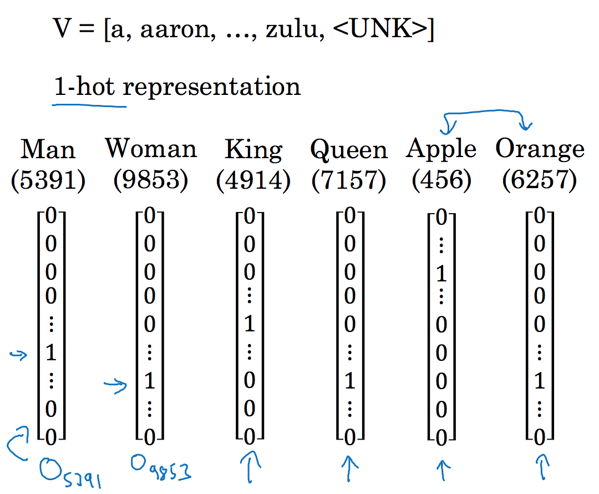
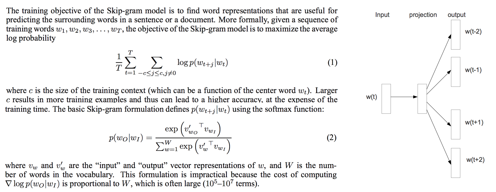
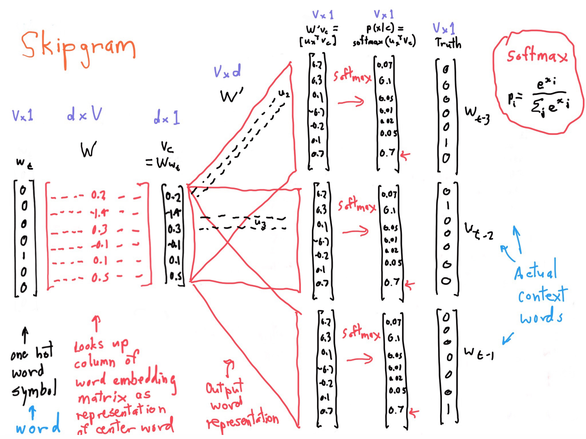
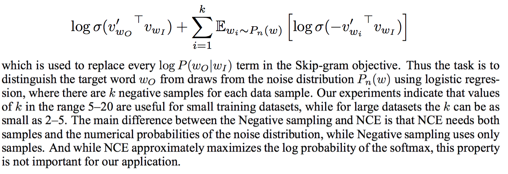
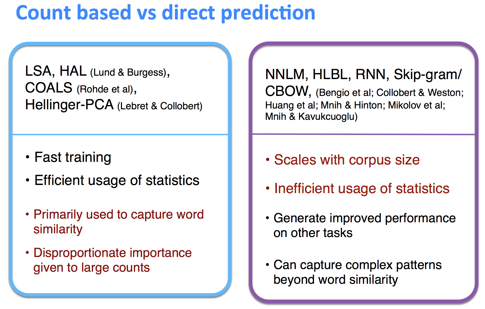
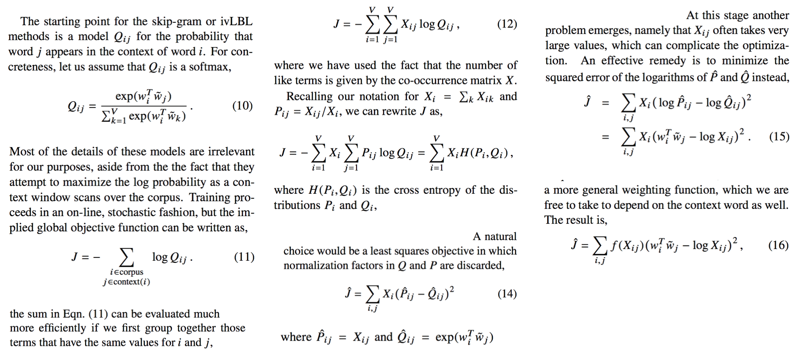
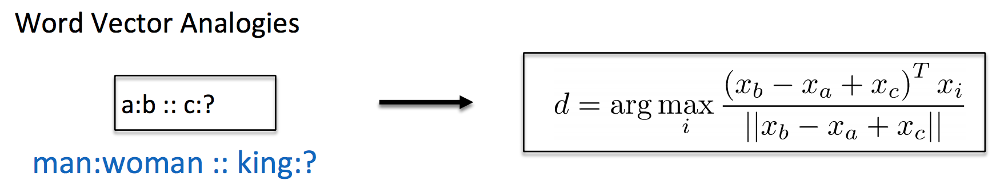

# Word Embeddings

_Notes below are adapted from Stanford's CS 224N notes, all rights belong to the course creataor._ 

## Table of Contents

* [Word Representation](https://github.com/robert8138/deep-learning-deliberate-practice/blob/master/concepts/word_embeddings.md#word-representation)

* [Discrete Representation: One-Hot Encoding](https://github.com/robert8138/deep-learning-deliberate-practice/blob/master/concepts/word_embeddings.md#discrete-representation-one-hot-encoding)

* [Distributional Representation: Word Embeddings using Word2Vec](https://github.com/robert8138/deep-learning-deliberate-practice/blob/master/concepts/word_embeddings.md#distributional-representation-word-embeddings-using-word2vec)
	* [Word2Vec](https://github.com/robert8138/deep-learning-deliberate-practice/blob/master/concepts/word_embeddings.md#word2vec)
	* [Skip Gram Model](https://github.com/robert8138/deep-learning-deliberate-practice/blob/master/concepts/word_embeddings.md#skip-gram-sg-model)
	* [Negative Sampling](https://github.com/robert8138/deep-learning-deliberate-practice/blob/master/concepts/word_embeddings.md#negative-sampling)

* [Co-occurrence Matrix & GloVe](https://github.com/robert8138/deep-learning-deliberate-practice/blob/master/concepts/word_embeddings.md#co-occurrence-matrix--glovec)
	* [Co-occurrence Matrix](https://github.com/robert8138/deep-learning-deliberate-practice/blob/master/concepts/word_embeddings.md#co-occurrence-matrix)
	* [Global Vectors](https://github.com/robert8138/deep-learning-deliberate-practice/blob/master/concepts/word_embeddings.md#global-vectors-glove)
		* [Prior Work](https://github.com/robert8138/deep-learning-deliberate-practice/blob/master/concepts/word_embeddings.md#prior-work)
		* [Issues](https://github.com/robert8138/deep-learning-deliberate-practice/blob/master/concepts/word_embeddings.md#issues)
		* [GloVe](https://github.com/robert8138/deep-learning-deliberate-practice/blob/master/concepts/word_embeddings.md#glove)

* [Evaluation of Embeddings](https://github.com/robert8138/deep-learning-deliberate-practice/blob/master/concepts/word_embeddings.md#evaluation-of-embeddings)

* [Visualization of Embeddings](https://github.com/robert8138/deep-learning-deliberate-practice/blob/master/concepts/word_embeddings.md#visualizing-embeddings)
	* [Dimension Reduction Techniques]()
	* [How to use t-SNE effectively]()

## Word Representation



## Discrete Representation: One-Hot Encoding

Word representation are the foundation of any statistical NLP algorithms. Historically, many of the NLP tasks represent word tokens using [one-hot encoding](http://scikit-learn.org/stable/modules/generated/sklearn.preprocessing.OneHotEncoder.html). In this encoding scheme, we first take a text corpus, extract a **bag of words** ("bag" is to denote that the ordering of the words are lost), and then encode each word in the bag as a vector by setting the element position of our target word to be 1, and 0 elsewhere. For unseen words, we will often encode a new word token in the bag as `<unkonwn>`.

This one-hot encoding representation, although intuitive, has some serious shortfalls:

* The dimensionality of the one-hot encoded vectors can be enormous (dimension = cardinality of the bag of words)
* There is no natural notion of similarity for words that are similar / disimilar. The dot product of the word vectors will all be 0.



Sometimes people would attempt to use **featurized word representation**, but this is often limited because we need to explicitly define what each element in the vector representation captures (i.e. they are not learned). However, this approach motivates the use of distributional representation of words, and this is where Deep Learning comes in.

## Distributional Representation: Word Embeddings using Word2Vec

The idea behind distributional representation of a word can be summarized by the following quote:

```
"You shall know a word by the company it keeps"
```

Distributed representations of words in a vector space help learning algorithms to achieve better performance in natural language processing tasks by grouping similar words. This idea has since been applied to statistical language modeling with considerable success to applications such as automatic speech recognition, machine translation, and a wide range of NLP tasks.

The basic idea beyond distributed representation is simple - we can represent a word really well by the words surrounding it. The advantage of this learned representation is that words that are similar to each other will have high (say, cosine) similarity, and words that are disimilar would be far away from each other. Furthermore, the user has controls on what should be the dimensionality of the word representation (often low). We commonly referred to these learned word representation as **Word Embeddings**.

### Word2Vec

Word2Vec has been one of the most popular algorithms to learn word embeddings, the name came from the fact that for each word (`Word`), we are learning a word representation where the word can be represented as a vector (`Vec`). There are typically two formulation for Word2Vec: Continuous Bag of Words (CBOW), and Skip-Gram (SG), we will focus on the latter.

### Skip-Gram (SG) Model

[Mikolov et al.](https://arxiv.org/pdf/1310.4546.pdf) introduced the Skip-gram model, an efficient method for learning highquality vector representations of words from large amounts of unstructured text data. Unlike most of the previously used neural network architectures for learning word vectors, training of the Skipgram model does not involve dense matrix multiplications. This makes the training extremely efficient: an optimized single-machine implementation can train on more than 100 billion words in one day.



**Important Intuition**: because of the softmax function and the loss function formulation (see below), words that co-occur within the "radius" would be learned to have higher probability - this also means that the dot product of the co-occuring words will be high, which effectively is the cosine similarity of two vectors (when both vectors have norm 1). This learning algorithm therefore **force co-occuring words to have high similarity**.

**Note**: From the above formula is that the parameters of the model we are trying to learned are the two pairs of embeddings: one embeddings for the context word (`o`) and another one for embeddings for the target word (`t`). In other words, every word has two vectors!

Below is an illustration of how we compute the loss function of this Skip-Gram word2vec model:



With the loss function and optimization set up, we can start taking derivatives of the loss function w.r.t to the embeddings. Details of this derivation can be found from [CS 224 lecture notes](http://web.stanford.edu/class/cs224n/archive/WWW_1617/lectures/cs224n-2017-lecture2.pdf). You can also watch the [video lecture](https://www.youtube.com/watch?v=ERibwqs9p38&index=2&list=PL3FW7Lu3i5Jsnh1rnUwq_TcylNr7EkRe6) from Professor Manning.

### Negative Sampling

As mentioned above, the formulation above is impractical because the denominator term involves calculating dot products that is proportional to the number of words in the vocabulary set. One approach to solve this issue is Noise Contrasive Estimation (NCE). While NCE can be shown to approximately maximize the log probability of the softmax, the Skip-Gram model is only concerned with learning high quality word representations. So in practice, NCE is simplified to to Negative Sampling (as long as the word embeddings retain its quality):



**Main Idea:** Train binary logistic regression (notice the \sigma) for a true pair (center word and the word in the context window) v.s. a couple of noise pairs (the center word paired with a random word, most likely not in the context window). We want to maximize the probability that the true pair, and minimize the probabilities of the noise pairs. This effectively make true pairs closer (with higher similarity / dot product), and noise pairs further (low similarity / dot product).

Typically, the sampling probability distribution takes the unigram distribution, raised to the 3/4 power to make less frequent word be sampled more often.

## Co-occurrence Matrix & GloVe

### Co-occurrence Matrix

The intuition behind Word2Vec is to capture **co-occurence** of pairs of words, so why not directly capture co-occurrence count? We can achieve this by using Window-based co-occurrence matrix. The window size is a parameter that can be tuned, and the matrix is symmetric. One problem with using the window-based co-occurrence matrix is that this matrix increases with the size of the vocabulary. It's very high dimensional and suffers from sparsity issues. One way to combat this is to leverage matrix decomposition such as SVD to store most of the information in a "fixed", small number of dimensions. This works, but with great computational burden (cost scales quadratically for a `n x m` matrix). 

### Global Vectors (GloVe)

[Pennington, Socher, and Manning](https://www.aclweb.org/anthology/D14-1162) developed GloVe: a new global logbilinear regression model that combines the advantages of the two major model families that we mentioned above: local context window methods and global matrix factorization. This model efficiently leverages statistical information by training only on the nonzero elements in a word-word cooccurrence matrix, rather than on the entire sparse matrix or on individual context windows in a large corpus. The model produces a vector space with meaningful substructure. It's called GloVe because this model directly captures global statistics of the corpus used for the unsupervised learning exercise.

#### Prior Work

[Section 2](https://www.aclweb.org/anthology/D14-1162) of the paper summarized related work and how it motivated GloVe:

* **Matrix Factorization Methods**: Matrix factorization methods for generating low-dimensional word representations have roots stretching as far back as LSA. These methods utilize low-rank approximations to decompose large matrices that capture statistical information about a corpus. The particular type of information captured by such matrices varies by application. In LSA, the matrices are of “term-document” type, i.e., the rows correspond to words or terms, and the columns correspond to different documents in the corpus. 

* **Shallow Window-Based Methods**: Another approach is to learn word representations that aid in making predictions within local context windows. Works from Bengio (2003)  introduced a model that learns word vector representations
as part of a simple neural network architecture for language modeling. Recently, the importance of the full neural network structure for learning useful word representations has been called into question. The skip-gram and continuous bag-of-words (CBOW) models of Mikolov et al. (2013a) propose a simple single-layer architecture based on the inner product between two word vectors.

#### Issues

A main problem with LSA and related methods is that the most frequent words contribute a disproportionate amount to the similarity measure. Unlike the matrix factorization methods, the shallow window-based methods suffer from the
disadvantage that they do not operate directly on the co-occurrence statistics of the corpus. Instead, these models scan context windows across the entire corpus, which fails to take advantage of the vast amount of repetition in the data.



#### GloVe

GloVe take inspiration from both matrix factorization methods (low-rank approximations) as well as window-based methods to learn word embeddings. The best explanation that draws the connection is from [section 3.1 Relationship to Other Models](https://www.aclweb.org/anthology/D14-1162), where the authors explained how window-based methods can be re-arrange similar to its current form.



It's also worth noting that GloVc trains matrix `U` and `V`, both captures co-occurrence information. It turns out that the best solution is to use `X_final = U + V`.


### Evaluation of Embeddings

There are typically two ways to evaluate word embeddings in NLP: **Intrinsic** v.s. **Extrinsic** evaluations.

* **Intrinsic**
	* Evaluation on a specific/intermediate subtask (e.g. word analogy / word vector distances and their correlation with human judgments)
	* Fast to compute
	* Helps to understand that system
	* Not clear if really helpful unless correlated to real task is established



* **Extrinsic**
	* Evaluation on a real task (e.g. name entity recognition, finding a person, organization or location)
	* Can take longer time to compute
	* Unclear if the subsystem is the problem or its interaction or other subsystems
	* If replacing exactly one subsystem with another improve accuracy -> winning!

### Visualizing Embeddings

#### Dimension Reduction Techniques

Chris Olah's [blog post on dimension reduction techniques](http://colah.github.io/posts/2014-10-Visualizing-MNIST/) is a nice introduction to visualizing embeddings using dimension reduction techniques, things he briefly covered are:

* Principal Component Analysis (PCA): will find the best possible "angle" for us. This really means to find the principal components that explains the most variance of the data, and view them that way.
* Multi-dimensional Scaling: This techniques make sure that the distance of two objects in high dimensional space is roughly the same as the distance in a low dimensional space. It's an optimization problem.
* Force-Directed Graph: This is trying to model the lower dimensional data in a graph, and visualize them.
* t-distributed Stochastic Neighbor Embeddings: tries to optimize for is preserving the topology of the data. For every point, it constructs a notion of which other points are its ‘neighbors,’ trying to make all points have the same number of neighbors. 

#### How to use t-SNE effectively

_This section is based on [how to use t-SNE effectively](https://distill.pub/2016/misread-tsne/)_

A popular method for exploring high-dimensional data is something called **t-SNE**, introduced by van der Maaten and Hinton in 2008 [1]. The technique has become widespread in the field of machine learning, since it has an almost magical ability to create compelling two-dimensonal “maps” from data with hundreds or even thousands of dimensions. 

Before diving in: if you haven’t encountered t-SNE before, here’s what you need to know about the math behind it. The goal is to take a set of points in a high-dimensional space and find a faithful representation of those points in a lower-dimensional space, typically the 2D plane. The algorithm is non-linear and adapts to the underlying data, performing different transformations on different regions.

* **Those hyperparameters really matter**
	* Perpelexity: (loosely) says how to balance attention between local and global aspects of your data. The parameter is, in a sense, a guess about the number of close neighbors each point has. The perplexity value has a complex effect on the resulting pictures.
	* Number of Steps: If you see a t-SNE plot with strange “pinched” shapes, chances are the process was stopped too early, and you should run it for a larger number of steps.

* **Cluster sizes in a t-SNE plot mean nothing**
	* t-SNE algorithm adapts its notion of “distance” to regional density variations in the data set. As a result, it naturally expands dense clusters, and contracts sparse ones, evening out cluster sizes.
	* The bottom line, however, is that you cannot see relative sizes of clusters in a t-SNE plot.

* **Distances between clusters might not mean anything**
	* The post gave a very good example that when perplexity is too low, t-SNE might not be able to capture the global structure. For example, if a cluster is 5 times away from the other clusters, for lower perplexity values the clusters look equidistant. When the perplexity is 100, we see the global geometry fine.
	* We can't always set perplexity to be a fixed high number, because we can lose local structure. Furthermore, perplexity really also depends on how many points you have per cluster.

* **Random noise doesn’t always look random**
	* When perplexity is too low, you can force local structure or clumps that are not random at all, so you are seeing patterns in what is really just random data

There’s a reason that t-SNE has become so popular: it’s incredibly flexible, and can often find structure where other dimensionality-reduction algorithms cannot. Unfortunately, that very flexibility makes it tricky to interpret. Out of sight from the user, the algorithm makes all sorts of adjustments that tidy up its visualizations. Don’t let the hidden “magic” scare you away from the whole technique, though. The good news is that by studying how t-SNE behaves in simple cases, it’s possible to develop an intuition for what’s going on.