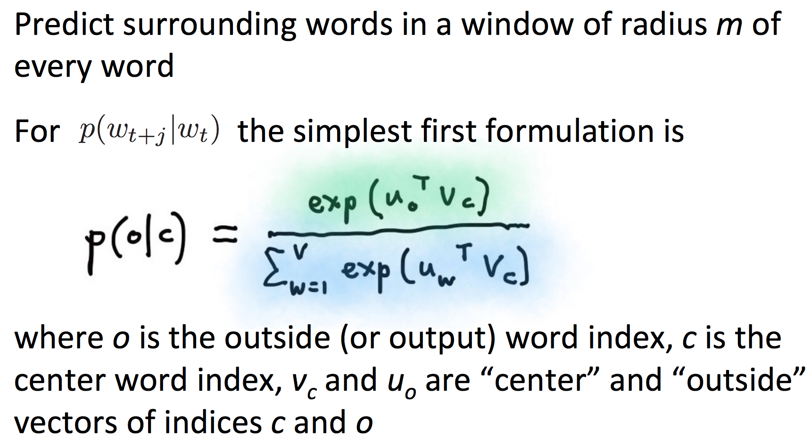

# Word Embeddings

_Notes below are adapted from Stanford's CS 224N notes, all rights belong to the course creataor._ 

## Table of Contents

* [Discrete Representation: One-Hot Encoding](https://github.com/robert8138/deep-learning-deliberate-practice/blob/master/concepts/work_in_progress/word_embeddings.md#discrete-representation-one-hot-encoding)
* [Distributional Representation: Word Embeddings using Word2Vec](https://github.com/robert8138/deep-learning-deliberate-practice/blob/master/concepts/work_in_progress/word_embeddings.md#distributional-representation-word-embeddings-using-word2vec)
	* [Word2Vec](https://github.com/robert8138/deep-learning-deliberate-practice/blob/master/concepts/work_in_progress/word_embeddings.md#word2vec)
* [Co-occurrence Matrix to GloVec]
* [Evaluation of Embeddings]

## Discrete Representation: One-Hot Encoding

Word representation are the foundation of any statistical NLP algorithms. Historically, many of the NLP tasks represent word tokens using [one-hot encoding](). In one-hot encoding, we first take a text corpus, define all possible set of word tokens, and then encode the word to a vector by setting the element position of our target word to be 1, and 0 elsewhere. 

The clear problems of one-hot encoding is that:

* The dimensionality of the one-hot encoded vectors can be enormous
* There is no natural notion of similarity for words that are similar / disimilar. The dot product of the word vectors will all be 0.

This motivates moving from symbolic representation to distributional representation of words.

## Distributional Representation: Word Embeddings using Word2Vec

The idea behind distributional representation of a word can be summarized by the following quote:

```
"You shall know a word by the company it keeps"
```

Essentially, we can represent a (centered) word really well by the context words surrounding it. The advantage of this learned representation is that words that are similar to each other will have high (say, cosine) similarity, and words that are disimilar would be far away from each other. Furthermore, the user has controls on what should be the dimensionality of the word representation (often low). We commonly referred to these learned word representation **Word Embeddings**.

This is one of the most successful ideas in modern NLP, of which `Word2Vec` algorithm, invented at Google, has been the most impactful. The high level idea behind Word2Vec is rather simple, we try to **predict the context words from a centered word.**

### Word2Vec

The name Word2Vec come from the fact that for each word (`Word2`), we are learning a word representation where the word can be represented as a vector (`Vec`). The way that Jeremy Howard put it is that word embeddings are like a **look-up table**: given a key that is a word token, the embedding matrix will return you a word embedding vector.

In the [original paper](), the authors mentioned two algorithms to predict between every word with its context words. They are:

* Skip-Gram (SG) Model
	* This model predicts context words for a given target/centered word

* Continuous Bag of Words (CBOW) Model
	* On the other hand, try to predict target word from a bag-of-words context

Regardless of the algorithm, it is useful to keep the following picture in mind:


The goal of the Skip-Gram Word2Vec model is, for every word `t = 1 ... T`, predict surrouding words in a window of "radius" of `m` of every word. The objective function then can be formulated as maximizing the probability of any context word given the current center word. Importantly, the `P(context word | target word)` will be modeled using a softmax probability function:



The important thing to remember from the above formula is that the parameters of the model we are trying to learned are the two pairs of embeddings: one embeddings for the context word (`o`) and another one for embeddings for the target word (`t`). In other words, every word has two vectors! 

Furthermore, because of the softmax function, words that co-occur within the "radius" would have higher probability - this also means that the dot product of the co-occuring words will be high, which effectively is the cosine similarity of two vectors (when they both have norm 1). This learning algorithm therefore **force co-occuring words to have high similarity**.

Below is an illustration of how we compute the loss function of this Skip-Gram word2vec model:


With the Loss Function and the optimization problem set up, we can start taking derivative of the loss function w.r.t the center word embeddings and context word embeddings. The detailed math can be found from [CS 224N Lecture notes](). You can also watch the [video lecture]() where Professor Manning derived some of the gradient in class.

Finally, with all the gradient calculated, we can use gradient descent to update and learn the **word embeddings**.


* Traditional Word Representation
	* [Colab's Explanation on Word Embeddings](https://colah.github.io/posts/2014-07-NLP-RNNs-Representations/)